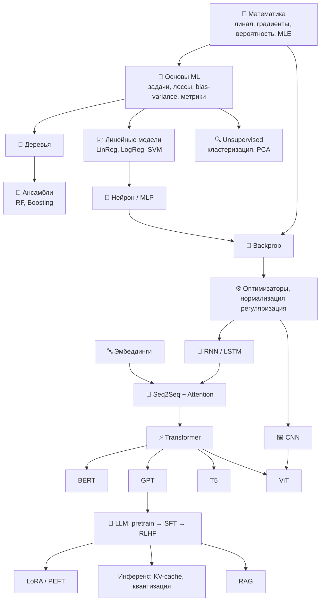

# 🎯 План подготовки к собеседованию (ML / DL / Transformers)

> [!info] Как пользоваться
> 1. Открой [[Roadmap.canvas|🗺 Roadmap (canvas)]] — там видно, **что от чего зависит**.
> 2. Иди по блокам **строго сверху вниз** (от простого к сложному).
> 3. В каждой заметке есть блок **«❓ Вопросы на собеседовании»** — проговаривай ответы вслух.
> 4. В конце — [[6.1 Вопросы и ответы]], [[6.2 Код на собеседовании]], [[6.3 Шпаргалка за час до]].

---

## ⏱ Интенсивный план «за 1 день» (~12–14 часов)

| Время | Блок | Что повторить | Приоритет |
|---|---|---|---|
| 0:00–0:45 | 🧮 Математика | [[1.1 Линейная алгебра]], [[1.2 Матанализ и градиенты]], [[1.3 Теория вероятностей]], [[1.4 Статистика и MLE]], [[1.5 Оптимизация]] | ⭐⭐ |
| 0:45–2:15 | 🧱 Основы ML | [[2.1 Постановка задач ML]] → [[2.8 Функции потерь]] → [[2.2 Bias-Variance и переобучение]] → [[2.3 Регуляризация]] → [[2.4 Валидация и подбор гиперпараметров]] → [[2.5 Метрики классификации]] → [[2.6 Метрики регрессии и ранжирования]] → [[2.7 Предобработка и Feature Engineering]] | ⭐⭐⭐ |
| 2:15–5:00 | 🌳 Классический ML | Линейные модели → kNN → Байес → SVM → Деревья → RF → **Бустинг** → Кластеризация → PCA → Аномалии → Рекомендации → Временные ряды → Дисбаланс | ⭐⭐⭐ |
| 5:00–5:30 | ☕ Перерыв + прогон вопросов по классике | [[6.1 Вопросы и ответы#Классический ML]] | |
| 5:30–8:30 | 🧠 Deep Learning | MLP → Backprop → Активации → Инициализация → Оптимизаторы → Нормализация → Регуляризация DL → CNN → RNN/LSTM → Эмбеддинги → Seq2Seq+Attention → Генеративные → Практика обучения | ⭐⭐⭐ |
| 8:30–11:30 | ⚡ Трансформеры | Self-Attention → MHA → Позиции → Архитектура → Токенизация → BERT/GPT/T5 → Обучение LLM → PEFT/LoRA → Декодирование → Инференс → Современные архитектуры → ViT → RAG | ⭐⭐⭐ |
| 11:30–12:30 | 💻 Код | [[6.2 Код на собеседовании]] — написать руками: linreg GD, logreg, kNN, k-means, softmax, attention, ROC-AUC | ⭐⭐⭐ |
| 12:30–13:30 | 🎤 Мок-интервью | [[6.1 Вопросы и ответы]] — отвечать вслух по 1–2 минуты | ⭐⭐⭐ |
| Утро перед | 📋 | [[6.3 Шпаргалка за час до]] | ⭐⭐⭐ |

> [!tip] Если времени совсем мало (4–5 часов)
> Только ⭐⭐⭐-темы: **метрики, bias-variance, регуляризация, логрег, деревья + бустинг, backprop, оптимизаторы, BatchNorm/LayerNorm, attention, архитектура трансформера, BERT vs GPT, LoRA, KV-cache** + вопросы.

---

## 🧭 Логика порядка изучения

---

## ✅ Чек-лист готовности

### Основы
- [ ] Могу объяснить bias-variance tradeoff на примере
- [ ] Знаю L1 vs L2 и **почему L1 даёт разреженность** (геометрия ромба)
- [ ] Precision / Recall / F1 / ROC-AUC / PR-AUC — когда что
- [ ] Кросс-валидация, утечки данных (data leakage), time-series split

### Классический ML
- [ ] Вывод МНК, градиент логлосса
- [ ] SVM: margin, kernel trick, hinge loss
- [ ] Критерии разбиения в деревьях (Gini, энтропия, MSE)
- [ ] Bagging vs Boosting; RF; GBDT — что такое «антиградиент»
- [ ] XGBoost vs LightGBM vs CatBoost
- [ ] K-means, DBSCAN, PCA (через SVD)

### Deep Learning
- [ ] Backprop на пальцах + chain rule
- [ ] Затухающие/взрывающиеся градиенты и как бороться
- [ ] SGD → Momentum → RMSProp → Adam → AdamW
- [ ] BatchNorm vs LayerNorm
- [ ] Dropout (train vs eval), Xavier/He инициализация
- [ ] Свёртка: размер выхода, receptive field, ResNet skip connection
- [ ] LSTM: гейты и зачем они

### Трансформеры
- [ ] Формула attention и **зачем делить на √d_k**
- [ ] Multi-head, маскирование, позиционные кодировки (sin, learned, RoPE)
- [ ] Encoder vs Decoder vs Encoder-Decoder; BERT (MLM) vs GPT (CLM)
- [ ] Сложность O(n²), KV-cache, FlashAttention, GQA
- [ ] BPE токенизация
- [ ] Pretrain → SFT → RLHF/DPO; LoRA; квантизация
- [ ] Температура, top-k, top-p, beam search
- [ ] RAG: ретривер, эмбеддинги, векторная БД

---

## 🏦 Специфика Сбера (на что обратить внимание)
- Много **табличных данных** (транзакции, кредитный скоринг) → **бустинг, логрег, метрики Gini = 2·AUC − 1**, дисбаланс классов, интерпретируемость (WoE/IV, SHAP).
- **NLP / GigaChat** → трансформеры, LLM, fine-tuning, RAG.
- **Антифрод** → аномалии, дисбаланс, PR-AUC.
- **Рекомендации** (СберМаркет, Okko, Звук) → коллаборативная фильтрация, ранжирование, NDCG.
- **Временные ряды** (прогноз спроса, cash-flow банкоматов).
- Часто спрашивают: «**расскажи про проект**», «как бы ты решал задачу X end-to-end» → см. [[6.1 Вопросы и ответы#ML System Design]].
