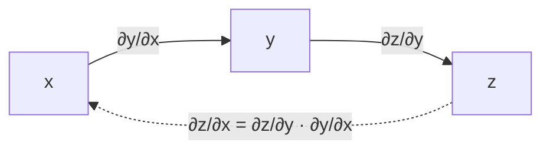

# 1.2 Матанализ и градиенты

## Производная и градиент
- Производная $f'(x)$ — скорость изменения функции.
- **Градиент** $\nabla f(x) = \left(\frac{\partial f}{\partial x_1}, \dots, \frac{\partial f}{\partial x_d}\right)$ — вектор, указывающий направление **наискорейшего роста**.
- **Антиградиент** $-\nabla f$ — направление наискорейшего убывания → [[1.5 Оптимизация|градиентный спуск]].

```
  f(x)
   │ \                 /
   │  \               /
   │   \    ←── -∇f  /
   │    \__       __/
   │       \_____/   ← минимум: ∇f = 0
   └──────────────────────── x
```

## Chain rule — сердце backprop
$$\frac{dz}{dx} = \frac{dz}{dy}\cdot\frac{dy}{dx}$$
Многомерно: если $z = f(y)$, $y = g(x)$, то $\frac{\partial z}{\partial x} = J_g^\top \frac{\partial z}{\partial y}$.


→ подробнее в [[4.2 Backpropagation]].

## Якобиан и гессиан
- **Якобиан** $J_{ij} = \frac{\partial f_i}{\partial x_j}$ — для векторной функции $f:\mathbb{R}^n\to\mathbb{R}^m$.
- **Гессиан** $H_{ij} = \frac{\partial^2 f}{\partial x_i \partial x_j}$ — кривизна. Используется в методе Ньютона, XGBoost (вторые производные!).

## Шпаргалка производных для ML
| Функция | Производная |
|---|---|
| $\sigma(x) = \frac{1}{1+e^{-x}}$ | $\sigma(x)(1-\sigma(x))$ — максимум 0.25 ⇒ затухание градиентов |
| $\tanh(x)$ | $1 - \tanh^2(x)$ — максимум 1 |
| $\text{ReLU}(x)$ | $1$ при $x>0$, $0$ иначе |
| $\log x$ | $1/x$ |
| $\text{softmax}_i$ по $z_j$ | $s_i(\delta_{ij} - s_j)$ |
| CE + softmax по логитам $z$ | $\hat p - y$ (очень красиво!) |
| BCE + sigmoid по логиту | $\hat p - y$ |
| MSE $\frac12(\hat y - y)^2$ | $\hat y - y$ |

> [!important] Красивый факт
> Для softmax + cross-entropy и sigmoid + log-loss градиент по логитам = **(предсказание − истина)**. Поэтому эти пары всегда используются вместе (и численно стабильно считаются как единая функция, например `CrossEntropyLoss` в PyTorch принимает **логиты**).

## Ряд Тейлора
$$f(x+\Delta) \approx f(x) + \nabla f^\top\Delta + \tfrac12\Delta^\top H\Delta$$
- 1-й порядок → градиентный спуск.
- 2-й порядок → метод Ньютона, **XGBoost** (раскладывает лосс до 2-го порядка, см. [[3.8 Градиентный бустинг]]).

## ❓ Вопросы
- Почему градиент — направление наискорейшего роста? Из $f(x+\varepsilon u) \approx f + \varepsilon\nabla f^\top u$, максимально при $u \parallel \nabla f$ (Коши–Буняковский).
- Посчитай производную сигмоиды (выше).
