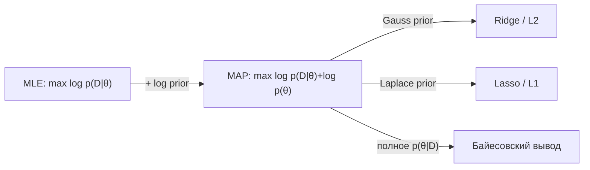

# 1.4 Статистика, MLE и MAP

## Метод максимального правдоподобия (MLE) ⭐
Выбираем параметры, при которых наблюдаемые данные **наиболее вероятны**:
$$\hat\theta_{MLE} = \arg\max_\theta \prod_i p(x_i|\theta) = \arg\max_\theta \sum_i \log p(x_i|\theta)$$
(логарифм: произведение → сумма, численно стабильно, argmax не меняется)

> [!important] Связь лоссов с MLE
> | Предположение о шуме / распределении | MLE ⇒ лосс |
> |---|---|
> | $y \sim \mathcal{N}(f(x), \sigma^2)$ | **MSE** |
> | $y \sim \text{Laplace}(f(x), b)$ | **MAE** |
> | $y \sim \text{Bernoulli}(\sigma(f(x)))$ | **Log-loss (BCE)** |
> | $y \sim \text{Categorical}(\text{softmax}(f(x)))$ | **Cross-entropy** |
> | $y \sim \text{Poisson}(e^{f(x)})$ | Poisson loss |

## MAP — максимум апостериорной вероятности
$$\hat\theta_{MAP} = \arg\max_\theta\, [\log p(D|\theta) + \log p(\theta)]$$
- Prior $\theta\sim\mathcal N(0,\tau^2)$ ⇒ **L2-регуляризация (Ridge)**
- Prior $\theta\sim\text{Laplace}(0,b)$ ⇒ **L1-регуляризация (Lasso)**

## Оценки: смещение и состоятельность
- **Несмещённая**: $\mathbb{E}\hat\theta = \theta$. Выборочная дисперсия с $\frac{1}{n-1}$ (поправка Бесселя) — несмещённая.
- **Состоятельная**: $\hat\theta \to \theta$ при $n\to\infty$.

## Проверка гипотез и A/B-тесты
- $H_0$ — нулевая гипотеза (эффекта нет), $H_1$ — альтернатива.
- **p-value** — вероятность получить такие или более экстремальные данные **при верной $H_0$**. (НЕ вероятность того, что $H_0$ верна!)
- **Ошибка I рода** (α, FP) — отвергли верную $H_0$. **Ошибка II рода** (β, FN) — не отвергли ложную. **Мощность** = $1-\beta$.
- Тесты: t-тест (средние), z-тест (пропорции/конверсии), χ² (категории), Манн–Уитни (непараметрический), бутстрап.
- **Множественные сравнения** → поправка Бонферрони ($\alpha/m$), Холма, FDR (Бенджамини–Хохберг).
- **MDE**, размер выборки: $n \propto \frac{(z_{1-\alpha/2}+z_{1-\beta})^2\sigma^2}{\text{MDE}^2}$.
- Подводные камни: peeking (подглядывание), SRM (несоответствие сплита), сетевые эффекты, новизна. Снижение дисперсии — **CUPED**.

## Доверительный интервал
$\bar x \pm z_{1-\alpha/2}\frac{s}{\sqrt n}$. **Бутстрап**: многократно сэмплируем с возвращением, считаем статистику, берём перцентили.

## ❓ Вопросы
- Что такое p-value? (см. выше, частая ловушка)
- Связь MSE и нормального шума; L2 и гауссова prior.
- Как определить, что A/B тест значим? Как выбрать размер выборки?
