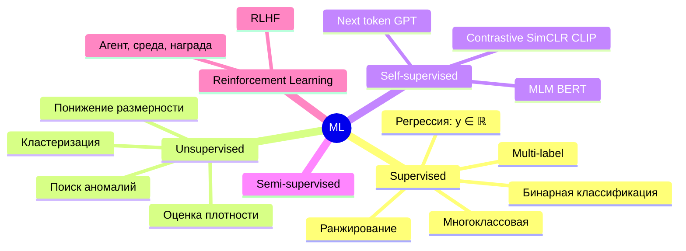

# 2.1 Постановка задач машинного обучения

## Общая схема
Есть объекты $x\in\mathbb X$, ответы $y\in\mathbb Y$, неизвестная зависимость $y = f(x)$. По обучающей выборке $\{(x_i,y_i)\}_{i=1}^n$ ищем модель $a(x)$ из семейства $\mathcal A$, минимизирующую **эмпирический риск**:
$$a^* = \arg\min_{a\in\mathcal A}\frac1n\sum_{i=1}^n L(y_i, a(x_i))$$

```mermaid
flowchart LR
    D[(Данные)] --> P[Предобработка<br/>+ признаки]
    P --> M[Модель a(x; w)]
    M --> L[Функция потерь]
    L --> O[Оптимизатор] -->|обновляет w| M
    M --> V[Валидация<br/>метрики] --> DEP[Деплой<br/>+ мониторинг]
```

## Типы задач


| Тип | Пример | Модели |
|---|---|---|
| Регрессия | цена квартиры, доход клиента | [[3.1 Линейная регрессия]], бустинг |
| Классификация | дефолт по кредиту, фрод | [[3.2 Логистическая регрессия]], [[3.8 Градиентный бустинг]] |
| Ранжирование | поисковая выдача, рекомендации | LambdaMART, [[3.12 Рекомендательные системы]] |
| Кластеризация | сегментация клиентов | [[3.9 Кластеризация]] |
| Аномалии | антифрод | [[3.11 Поиск аномалий]] |
| Генерация | текст, изображения | [[5.7 GPT и decoder-модели]], [[4.12 Генеративные модели]] |

## Ключевые термины
- **Признак (feature)** — характеристика объекта. Типы: числовые, категориальные, бинарные, порядковые, текст, изображения, даты.
- **Параметры** — обучаются (веса $w$). **Гиперпараметры** — задаются до обучения (глубина дерева, lr, λ).
- **Обучение (fit)** / **инференс (predict)**.
- **Обобщающая способность** — качество на новых данных. Цель ML — не запомнить train, а обобщить.
- **Параметрические** (линейные, нейросети — фиксированное число параметров) vs **непараметрические** (kNN, деревья — сложность растёт с данными).
- **Дискриминативные** ($p(y|x)$: логрег, SVM) vs **генеративные** ($p(x,y)$: наивный Байес, GMM, LLM).

## No Free Lunch
Нет алгоритма, лучшего на всех задачах. Выбор модели = индуктивное смещение под данные: таблицы → бустинг, изображения → CNN/ViT, текст → трансформеры.

## ❓ Вопросы
- Чем параметр отличается от гиперпараметра?
- Discriminative vs generative — примеры?
- Что такое self-supervised? Обучение на разметке, сгенерированной из самих данных (маскирование, следующий токен).
