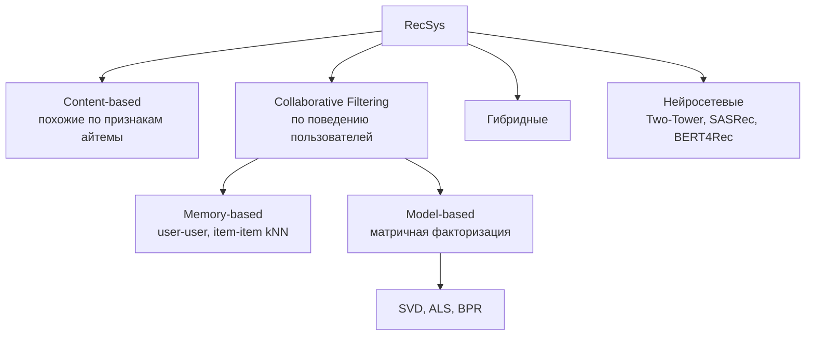

# 3.12 Рекомендательные системы

## Типы подходов


## Матрица взаимодействий
```
           фильм1 фильм2 фильм3 фильм4
 user1  [   5      ?      3      ?  ]
 user2  [   ?      4      ?      1  ]     ≈   U (users × k)  ·  Vᵀ (k × items)
 user3  [   4      ?      ?      5  ]
```
Огромная и **очень разреженная**.

## Матричная факторизация
$\hat r_{ui} = p_u^\top q_i + b_u + b_i + \mu$; минимизируем $\sum_{(u,i)\in\text{obs}}(r_{ui}-\hat r_{ui})^2 + \lambda(\|p_u\|^2+\|q_i\|^2)$.
- **SGD** (Funk SVD) или **ALS** (Alternating Least Squares: фиксируем $U$ — решаем МНК для $V$, и наоборот; параллелится).
- **Implicit feedback** (клики, просмотры, покупки — нет явных негативов): iALS с весами уверенности, **BPR** (pairwise: позитив должен быть выше случайного негатива).

## Двухэтапная архитектура (индустрия)
```
 Миллионы айтемов → [Кандидаты (retrieval)] → сотни → [Ранжирование] → топ-N → [Бизнес-правила, разнообразие]
                     ALS, Two-Tower + ANN,          CatBoost/LightGBM (LambdaMART),
                     item2vec, популярное            нейросеть с богатыми признаками
```
- **Two-Tower**: башня пользователя и башня айтема → эмбеддинги → скалярное произведение → ANN-поиск ([[3.3 kNN#Ускорение]]).
- **Последовательные**: SASRec, BERT4Rec — трансформеры над историей.

## Проблемы
- **Cold start** (новый пользователь/айтем) → content-based, популярное, признаки.
- **Popularity bias**, **feedback loop**, разнообразие, exploration vs exploitation (**многорукие бандиты**: ε-greedy, UCB, Thompson sampling).
- Метрики: [[2.6 Метрики регрессии и ранжирования|NDCG, MAP, Recall@k, HitRate]], coverage, novelty; онлайн — A/B.

## ❓ Вопросы
- Collaborative vs content-based?
- Как решить холодный старт?
- Как устроена рекомендательная система с миллионами товаров? (retrieval + ranking)
- Explicit vs implicit feedback?
