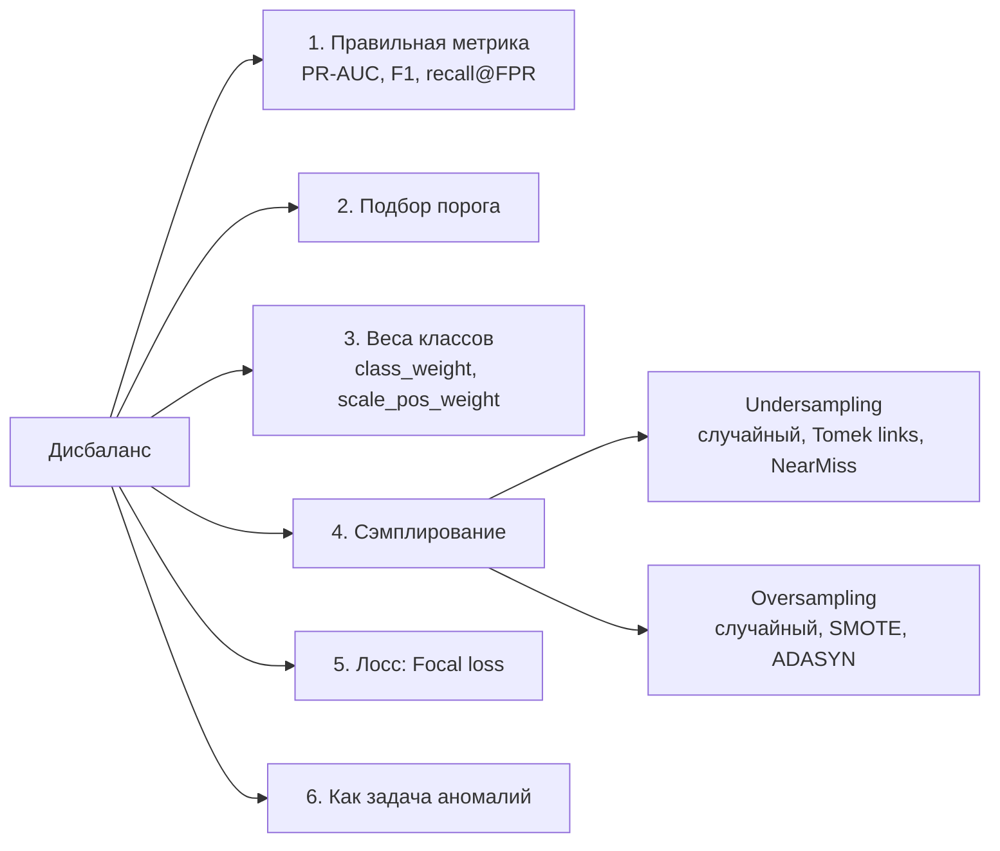

# 3.14 Дисбаланс классов

Пример: фрод 0.1%, дефолт 3%, отток 5%.

## Что делать

1. **Метрики**: не accuracy! PR-AUC, ROC-AUC, F1, precision/recall на рабочем пороге. → [[2.5 Метрики классификации]]
2. **Порог**: дефолт 0.5 почти никогда не оптимален; подбирать на валидации под бизнес-стоимость ошибок.
3. **Веса классов**: умножаем лосс миноритарного класса на $w \approx \frac{N_{neg}}{N_{pos}}$. Самый простой и часто лучший способ.
4. **Сэмплирование** (только на train, **внутри CV**!):
   - Undersampling — теряем данные, но быстро.
   - **SMOTE**: синтетические объекты на отрезке между объектом миноритарного класса и его соседом: $x_{new} = x_i + \lambda(x_{nn}-x_i)$. Плохо в высокой размерности и с категориями; для бустингов часто не помогает.
5. **Focal loss** — снижает вес лёгких примеров.
6. **Аномалии** — при экстремальном дисбалансе.

> [!warning] Пересэмплирование ломает калибровку
> После under/oversampling или весов вероятности смещены — их нужно скорректировать (prior correction / калибровка), если нужны реальные PD.

## ❓ Вопросы
- 1% положительных — что будешь делать?
- Можно ли делать SMOTE до разбиения на train/test? (нет — утечка)
