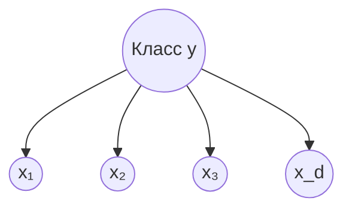

# 3.4 Наивный Байес

## Идея
По [[1.3 Теория вероятностей#Теорема Байеса ⭐|теореме Байеса]]:
$$p(y|x) \propto p(y)\,p(x|y) \overset{\text{наивно}}{=} p(y)\prod_{j=1}^d p(x_j|y)$$
**«Наивное» предположение**: признаки **условно независимы** при известном классе.

$$\hat y = \arg\max_y \Big[\log p(y) + \sum_j\log p(x_j|y)\Big]$$

## Варианты
| Вариант | $p(x_j|y)$ | Где |
|---|---|---|
| **Gaussian NB** | нормальное | непрерывные признаки |
| **Multinomial NB** | мультиномиальное (счётчики слов) | классификация текстов, спам |
| **Bernoulli NB** | бинарные | наличие слова |
| **Complement NB** | | несбалансированные тексты |

**Сглаживание Лапласа**: $p(x_j=v|y) = \frac{\text{count}+\alpha}{N_y + \alpha K}$ — чтобы не получить 0 для невстреченного слова (иначе всё произведение = 0).

## Плюсы / минусы
✅ Очень быстрый, мало данных нужно, хорош для текстов, онлайн-обучение.
❌ Предположение независимости почти всегда нарушено → вероятности **плохо откалиброваны** (слишком уверенные), хотя ранжирование часто нормальное.

## Генеративная vs дискриминативная
NB — **генеративная** модель $p(x,y)$; логрег — её дискриминативная пара (для Gaussian NB с общей ковариацией граница тоже линейна).

## ❓ Вопросы
- В чём «наивность»?
- Зачем сглаживание Лапласа?
- Почему NB работает на текстах, несмотря на неверное предположение?
