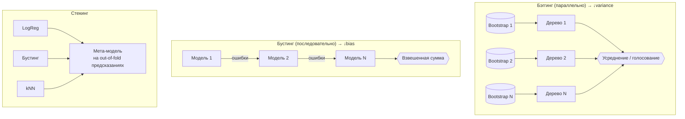

# 3.7 Ансамбли: Бэггинг и Random Forest ⭐⭐⭐

## Зачем ансамбли
Объединение многих слабо коррелированных моделей уменьшает ошибку. «Мудрость толпы».

## Бэггинг (Bootstrap AGGregatING)
1. Генерируем $N$ **бутстрап-выборок** (сэмплинг $n$ объектов **с возвращением**).
2. На каждой обучаем модель (обычно глубокое дерево — низкий bias, высокая variance).
3. Усредняем (регрессия) или голосуем (классификация).

**Почему работает**: $\mathrm{Var}(\bar f) = \rho\sigma^2 + \frac{1-\rho}{N}\sigma^2$. Bias не меняется, variance падает — тем сильнее, чем **меньше корреляция** $\rho$ между моделями.

В бутстрап-выборку попадает ≈ $1 - (1-\frac1n)^n \approx 1 - \frac1e \approx$ **63.2%** уникальных объектов. Оставшиеся ~37% — **Out-of-Bag (OOB)** → бесплатная валидация.

## Random Forest
Бэггинг деревьев **+ случайное подмножество признаков в каждом разбиении** (`max_features`: $\sqrt d$ для классификации, $d/3$ для регрессии) → деревья **декоррелируются** сильнее.

| Гиперпараметр | Влияние |
|---|---|
| `n_estimators` | больше — лучше (не переобучает!), но дольше; выход на плато |
| `max_features` | меньше → меньше корреляция, но выше bias каждого дерева |
| `max_depth`, `min_samples_leaf` | обычно деревья глубокие |
| `bootstrap`, `max_samples` | |

✅ Очень устойчив, мало тюнинга, параллелится, OOB-оценка, важности признаков, не нужно масштабирование.
❌ Медленнее бустинга по качеству на таблицах, большой размер модели, не экстраполирует, плохо на разреженных высокоразмерных данных (тексты).

> [!question] Может ли RF переобучиться при увеличении числа деревьев?
> **Нет** — ошибка сходится к пределу. Переобучиться может из-за слишком глубоких деревьев на шумных данных, но не из-за числа деревьев. (У бустинга — может!)

## Extra Trees (Extremely Randomized Trees)
Пороги выбираются **случайно** (а не оптимально) → ещё меньше variance, быстрее.

## Голосование и стекинг
- **Hard voting** — большинство; **soft voting** — среднее вероятностей.
- **Блендинг** — мета-модель на hold-out.
- **Стекинг** — мета-модель (часто логрег) на **out-of-fold** предсказаниях базовых моделей (чтобы не было утечки).

## ❓ Вопросы
- В чём разница бэггинга и бустинга? (параллельно/последовательно, variance/bias, глубокие/неглубокие деревья)
- Почему в RF случайные признаки?
- Что такое OOB? Откуда 63%?
- Переобучается ли RF при росте n_estimators?
