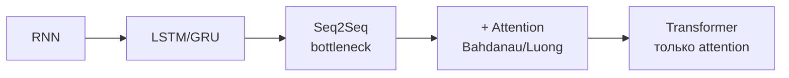

# 4.11 Seq2Seq и механизм внимания — мост к трансформерам ⭐

## Seq2Seq (Sutskever 2014)
Encoder RNN читает вход и сжимает в вектор контекста $c = h_T$; Decoder RNN генерирует выход из $c$.
```
 Encoder                               Decoder
 [Я]→[люблю]→[ML]→ h_T = c ═══════▶ [<s>]→[I]→[love]→[ML]
                     ↑                    ↓    ↓     ↓
               bottleneck!               I   love   ML  </s>
         вся фраза в один вектор фиксированного размера
```
**Проблема**: для длинных предложений один вектор — узкое горлышко, качество падает с длиной.

## Attention (Bahdanau 2014) ⭐
**Идея**: на каждом шаге декодер **сам смотрит на все** скрытые состояния энкодера и берёт взвешенную сумму — то, что релевантно сейчас.

На шаге декодера $t$:
1. **Оценки (scores)**: $e_{t,i} = \text{score}(s_{t-1}, h_i)$ — насколько входное слово $i$ важно сейчас.
2. **Веса**: $\alpha_{t,i} = \text{softmax}_i(e_{t,i})$ — сумма = 1.
3. **Контекст**: $c_t = \sum_i\alpha_{t,i}h_i$.
4. Декодер использует $c_t$ (свой для каждого шага!).

```
 Генерируем "love":
   h₁(Я)   h₂(люблю)   h₃(ML)
    │0.1      │0.8        │0.1     ← α (softmax от scores)
    └────────(Σ)──────────┘
              ↓
           c_t ─→ [Decoder] → "love"
```
Score-функции: **additive (Bahdanau)** $v^\top\tanh(W_1s + W_2h)$; **dot-product (Luong)** $s^\top h$; **general** $s^\top Wh$; **scaled dot-product** $\frac{s^\top h}{\sqrt d}$ ← в трансформере.

Бонус: матрица $\alpha$ — **интерпретируемое выравнивание** (alignment) слов.

## Обобщение: Query, Key, Value
Attention = **мягкий поиск в словаре**:
- **Query** (запрос) — что ищу (состояние декодера $s_t$).
- **Key** (ключ) — с чем сравниваю (состояния энкодера $h_i$).
- **Value** (значение) — что достаю (тоже $h_i$).
$$\text{Attention}(q, K, V) = \sum_i\text{softmax}(q\cdot k_i)\,v_i$$

```
 Обычный словарь:   query "cat" == key "cat" → value  (жёстко, одно)
 Attention:         query ≈ все keys → softmax → взвешенная смесь values (мягко, дифференцируемо)
```

## Следующий шаг — «Attention Is All You Need» (2017)
Если attention так хорош — **уберём RNN совсем**:
- **Self-attention**: каждое слово делает запрос ко **всем словам той же последовательности** (Q, K, V из одной последовательности).
- Полная параллелизация, прямой путь между любыми двумя позициями (длина пути $O(1)$ вместо $O(n)$).
→ [[5.1 Self-Attention]]



## ❓ Вопросы
- Какую проблему seq2seq решает attention?
- Что такое Q, K, V?
- Bahdanau vs Luong attention?
