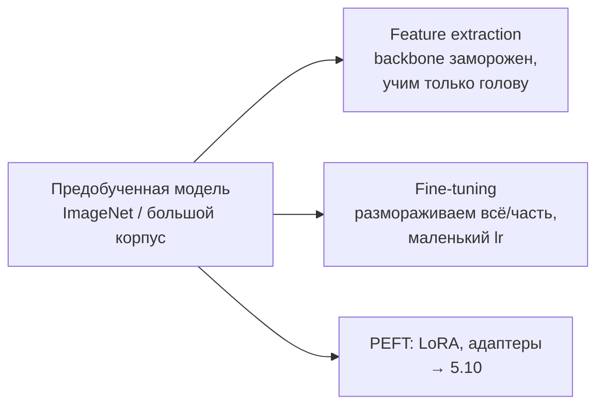

# 4.13 Практика обучения нейросетей

## Transfer learning и fine-tuning

- Мало данных + похожий домен → feature extraction.
- Много данных или другой домен → full fine-tuning.
- **Discriminative lr**: нижним слоям меньший lr (они учат общие признаки).
- Постепенная разморозка (gradual unfreezing).
- **Catastrophic forgetting** — модель забывает старые знания при дообучении.

## Рецепт отладки (Karpathy)
1. Проверить данные глазами, метки, аугментации.
2. Начальный лосс ≈ ожидаемому ($\ln K$ для K классов при случайной init).
3. **Переобучиться на одном батче** — если не может, баг в модели/лоссе.
4. Простой бейзлайн → постепенно усложнять.
5. Подобрать lr (LR finder), смотреть кривые train/val.
6. Регуляризация — после того, как модель смогла переобучиться.

## Типичные проблемы
| Симптом | Возможная причина |
|---|---|
| Лосс NaN | большой lr, взрыв градиентов, log(0), деление на 0, fp16 переполнение |
| Лосс не падает | маленький/огромный lr, забыли `zero_grad`, баг в данных, мёртвые ReLU, неправильный лосс (softmax перед CrossEntropyLoss) |
| Train ↓, val ↑ | переобучение → [[4.7 Регуляризация в DL]] |
| Train ≈ val, оба плохие | недообучение → больше модель/дольше |
| Скачки лосса | большой lr, плохие батчи, нет warmup |
| Разные результаты eval | забыли `model.eval()` (Dropout, BatchNorm), `torch.no_grad()` |

## Эффективность обучения
- **Mixed precision** (FP16/BF16 + FP32 master weights): ×2 скорость, ½ память. FP16 нужен **loss scaling** (малые градиенты → underflow); **BF16** — тот же диапазон, что FP32, scaling не нужен (стандарт для LLM).
- **Gradient accumulation** — большой эффективный батч при малой памяти.
- **Gradient checkpointing** — память ↔ вычисления.
- **Распределённое обучение**: Data Parallel (DDP), **FSDP/ZeRO** (шардинг параметров, градиентов, состояний оптимизатора), Tensor Parallel, Pipeline Parallel. → [[5.9 Обучение LLM]]
- DataLoader: `num_workers`, `pin_memory`, prefetch.
- `torch.compile`, fused kernels.

## Дистилляция знаний
Маленький студент учится на **мягких** предсказаниях большого учителя: $L = \alpha\,CE(y, p_s) + (1-\alpha)T^2\,KL(p_t^{(T)}\|p_s^{(T)})$. «Тёмные знания» — информация в вероятностях неправильных классов. DistilBERT, TinyBERT.

## Сжатие и деплой
Квантизация (INT8/INT4), прунинг (структурный/неструктурный), дистилляция, ONNX, TensorRT, Triton. → [[5.12 Эффективность и инференс]]

## Self-supervised и contrastive learning
- **Contrastive**: SimCLR, MoCo — две аугментации одной картинки = позитивная пара, остальные в батче — негативы (InfoNCE).
- **Non-contrastive**: BYOL, DINO.
- **Masked modeling**: BERT (текст), MAE (картинки).
- **CLIP** — контраст картинка ↔ текст.

## ❓ Вопросы
- Как дообучить модель на маленьком датасете?
- Лосс стал NaN — что проверишь?
- Что такое mixed precision? FP16 vs BF16?
- Что такое дистилляция?
