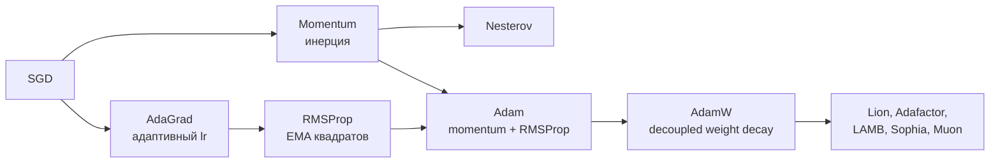

# 4.5 Оптимизаторы ⭐⭐⭐



## SGD
$$w \leftarrow w - \eta\,g_t$$
Проблема: в «оврагах» (разная кривизна по направлениям) — осцилляции поперёк и медленное движение вдоль.

## Momentum
$$v_t = \beta v_{t-1} + g_t,\qquad w\leftarrow w - \eta v_t \quad(\beta\approx0.9)$$
Накапливаем «скорость» — шарик катится с инерцией: гасит осцилляции, ускоряется вдоль устойчивого направления, проскакивает мелкие локальные минимумы.
```
  SGD:        ↗↘↗↘↗↘↗↘ → ●     (зигзаг по оврагу)
  Momentum:   ↗→→→→→→→ ●       (сглаженно и быстро)
```
**Nesterov**: градиент считаем в точке «заглядывания вперёд» $w - \eta\beta v$.

## AdaGrad
$G_t = G_{t-1} + g_t^2$; $w \leftarrow w - \frac{\eta}{\sqrt{G_t}+\varepsilon}g_t$. Персональный lr для каждого параметра: редкие признаки получают больший шаг. ❌ $G$ только растёт → lr → 0.

## RMSProp
$s_t = \beta s_{t-1} + (1-\beta)g_t^2$ — **экспоненциальное** среднее вместо суммы. Lr не умирает.

## Adam ⭐ (Adaptive Moment Estimation)
$$m_t = \beta_1 m_{t-1} + (1-\beta_1)g_t \quad\text{(1-й момент, momentum)}$$
$$v_t = \beta_2 v_{t-1} + (1-\beta_2)g_t^2 \quad\text{(2-й момент, RMSProp)}$$
$$\hat m_t = \frac{m_t}{1-\beta_1^t},\quad \hat v_t = \frac{v_t}{1-\beta_2^t}\quad\text{(bias correction — т.к. } m_0=v_0=0)$$
$$w \leftarrow w - \eta\frac{\hat m_t}{\sqrt{\hat v_t}+\varepsilon}$$
Дефолты: $\beta_1=0.9,\ \beta_2=0.999,\ \varepsilon=10^{-8}$, $\eta=10^{-3}$ (для трансформеров $\sim10^{-4}$, $\beta_2=0.95$).
Память: **2 дополнительных тензора** размером с модель (m и v) → важно для LLM (см. [[5.9 Обучение LLM#Память]]).

## AdamW ⭐
В Adam L2-регуляризация, добавленная в градиент, **делится на $\sqrt{\hat v}$** → параметры с большими градиентами регуляризуются слабее. **AdamW** применяет weight decay **напрямую** к весам, отдельно от адаптивного шага:
$$w \leftarrow w - \eta\Big(\frac{\hat m_t}{\sqrt{\hat v_t}+\varepsilon} + \lambda w\Big)$$
**Стандарт для трансформеров.** Обычно decay не применяют к bias и параметрам LayerNorm.

## Сравнение
| | SGD+Momentum | Adam/AdamW |
|---|---|---|
| Скорость сходимости | медленнее | быстрее, меньше тюнинга |
| Обобщение | часто лучше (CNN на ImageNet) | чуть хуже (исторически), AdamW исправил |
| Память | +1 тензор | +2 тензора |
| Где | CNN, классическое CV | трансформеры, NLP, почти всё |

## Learning rate schedules ⭐
lr — **самый важный гиперпараметр**.
```
 lr  Warmup + Cosine decay (трансформеры)
  │    ╱‾‾‾‾‾‾‾‾‾‾‾‾‾‾‾‾‾‾‾‾‾‾‾‾--.__
  │   ╱                              `-._
  │  ╱                                   `-._
  │ ╱                                        `--.
  └╱──────────────────────────────────────────── step
   warmup
```
- **Step decay**, exponential decay, **ReduceLROnPlateau**.
- **Cosine annealing** (+ warm restarts).
- **Warmup**: в начале lr линейно растёт — Adam-статистики $v$ ещё не устоялись, большие обновления на случайных весах дестабилизируют (особенно трансформеры с Post-LN).
- **One-cycle** (Smith), **WSD** (warmup-stable-decay, современные LLM).
- **LR finder**: увеличиваем lr экспоненциально, выбираем чуть меньше точки, где лосс начинает расти.

## Batch size
Больший батч → точнее градиент, лучше утилизация GPU, но меньше «шума» (может хуже обобщать, sharp minima). **Linear scaling rule**: batch ×k → lr ×k (с warmup). Не помещается в память → **gradient accumulation**.

## ❓ Вопросы
- Как работает Adam? Зачем bias correction?
- Чем AdamW отличается от Adam с L2?
- Зачем warmup?
- Momentum — интуиция?
- Что будет при слишком большом/маленьком lr?
