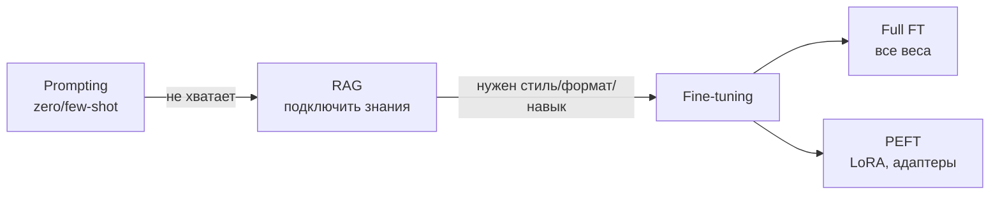

# 5.10 Fine-tuning и PEFT (LoRA, QLoRA) ⭐⭐⭐

## Варианты адаптации LLM под задачу

> [!tip] Правило
> **Знания** (факты, документы, свежие данные) → **RAG**. **Поведение** (формат, стиль, домен, специфичная задача) → **fine-tuning**. Сначала всегда пробуем промптинг.

## Full fine-tuning
Обновляем все веса. ❌ Память ≈16 байт/параметр (см. [[5.9 Обучение LLM#Память при обучении ⭐]]), отдельная копия модели на каждую задачу, catastrophic forgetting.

## PEFT — Parameter-Efficient Fine-Tuning
Обучаем **<1%** параметров, базовая модель заморожена.

### LoRA (Low-Rank Adaptation) ⭐
Гипотеза: изменение весов при дообучении имеет **низкий внутренний ранг**.
$$W' = W_0 + \Delta W = W_0 + \frac{\alpha}{r}BA,\qquad B\in\mathbb R^{d\times r},\ A\in\mathbb R^{r\times k},\ r\ll d$$
```
           x (k)
     ┌──────┴──────┐
     ▼             ▼
 ┌────────┐      ┌───┐ A (r×k), init ~ N(0,σ)
 │  W₀    │      └─┬─┘
 │(d×k)   │        │ r (например, 8)
 │ 🔒     │      ┌─┴─┐ B (d×r), init = 0  ← в начале ΔW = 0
 │frozen  │      └─┬─┘
 └───┬────┘        │ × α/r
     └──────(+)────┘
             ▼
           h (d)
```
- Параметры: $r(d+k)$ вместо $dk$. Пример $d=k=4096$, $r=8$: 65k вместо 16.7M (**в 256 раз меньше**).
- $B=0$ при инициализации → начинаем ровно с исходной модели.
- Применяют к $W_Q, W_V$ (оригинал) или ко всем линейным слоям (лучше).
- Гиперпараметры: $r$ (4–64), $\alpha$ (часто $2r$), dropout, target modules.
- ✅ **Нет задержки на инференсе** — можно слить $W = W_0 + BA$. Маленькие адаптеры (МБ) → много задач на одной базе, быстрое переключение (multi-LoRA serving).
- Память: нет градиентов и Adam-состояний для $W_0$.

### QLoRA ⭐
LoRA поверх **4-битной квантованной** замороженной модели:
- **NF4** (NormalFloat4) — квантизация, оптимальная для нормально распределённых весов.
- **Double quantization** — квантуем и константы квантизации.
- **Paged optimizers** — выгрузка состояний оптимизатора в CPU при пиках.
→ дообучение 65B модели на одной 48GB GPU.

### Другие PEFT
| Метод | Суть |
|---|---|
| **Adapters** (Houlsby) | маленькие bottleneck-MLP между слоями; ❌ добавляют задержку |
| **Prefix tuning** | обучаемые векторы, добавляемые к K,V в каждом слое |
| **Prompt tuning / P-tuning** | обучаемые «мягкие» токены на входе |
| **(IA)³** | обучаемые векторы-множители активаций |
| **BitFit** | обучаем только bias |
| **DoRA** | разложение на величину и направление + LoRA |
| **LoRA+, rsLoRA, AdaLoRA** | улучшения LoRA (разные lr для A/B, масштабирование, адаптивный ранг) |

## Практика
- Библиотеки: HuggingFace `transformers`, `peft`, `trl` (SFTTrainer, DPOTrainer), `unsloth`, `axolotl`.
- Качество данных важнее количества; чистые форматы, разнообразие.
- Следить за **catastrophic forgetting** (смешивать общие данные), переобучением (мало эпох, 1–3).
- Оценка: hold-out + LLM-as-judge + ручная проверка.

## ❓ Вопросы
- Как работает LoRA? Почему $B$ инициализируют нулём? Сколько параметров?
- Почему LoRA не замедляет инференс?
- Что такое QLoRA?
- Fine-tuning vs RAG — когда что?
- Что такое catastrophic forgetting и как бороться?
