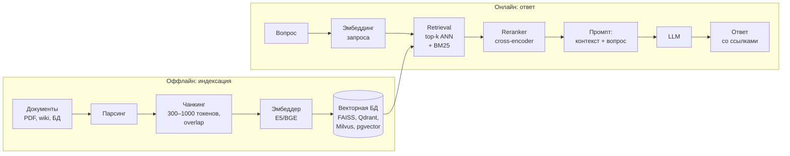

# 5.15 RAG и LLM-агенты ⭐⭐⭐

## RAG — Retrieval-Augmented Generation
Проблемы LLM: галлюцинации, устаревшие знания, нет доступа к внутренним документам (банковские регламенты!). Решение — **найти релевантные документы и подложить в промпт**.



### Компоненты и улучшения
| Этап | Техники |
|---|---|
| **Чанкинг** | фиксированный размер + overlap, по структуре (заголовки, абзацы), семантический; parent-child (ищем мелкие, отдаём крупные) |
| **Эмбеддинги** | bi-encoder (быстро; вектор документа заранее) — E5, BGE, multilingual-e5; дообучение на домене |
| **Поиск** | dense (ANN: HNSW) + **sparse BM25** → **гибридный** (RRF — reciprocal rank fusion); фильтры по метаданным |
| **Reranking** | **cross-encoder** (запрос и документ вместе через BERT — точно, но медленно, поэтому только на top-50) |
| **Запрос** | query rewriting, multi-query, **HyDE** (генерируем гипотетический ответ и ищем по нему), декомпозиция |
| **Генерация** | инструкция «отвечай только по контексту, иначе скажи не знаю», цитирование источников |
| **Продвинутое** | GraphRAG (граф знаний), agentic RAG (LLM сама решает, когда и что искать), self-RAG |

```
 Bi-encoder:     q → [Enc] → v_q ┐                Cross-encoder:  [q ; d] → [BERT] → score
                 d → [Enc] → v_d ┴→ cos(v_q,v_d)  (точнее, но нельзя предвычислить)
```

**BM25** — улучшенный TF-IDF с насыщением частоты и нормировкой длины; хорош для точных терминов, номеров, редких слов.

### Оценка RAG
- **Retrieval**: Recall@k, MRR, NDCG ([[2.6 Метрики регрессии и ранжирования]]).
- **Generation**: faithfulness (ответ опирается на контекст, нет галлюцинаций), answer relevance, context precision/recall. Фреймворки: RAGAS, LLM-as-judge.

### RAG vs Fine-tuning vs длинный контекст
| | RAG | Fine-tuning | Long context |
|---|---|---|---|
| Новые знания | ✅ легко обновлять | ❌ плохо, галлюцинации | ✅ но дорого |
| Источники/цитаты | ✅ | ❌ | частично |
| Стиль/формат/навык | ❌ | ✅ | ❌ |
| Стоимость | средняя | обучение | высокая на запрос |

## LLM-агенты
LLM в цикле **рассуждение → действие (вызов инструмента) → наблюдение**:
```
 Цель → [LLM: думаю…] → вызов tool (поиск, SQL, API, код) → результат → [LLM: думаю…] → … → финальный ответ
```
- **ReAct** (Reason + Act), **function calling / tool use** (модель выдаёт JSON с аргументами функции).
- Память (краткосрочная — контекст, долгосрочная — векторная БД), планирование, рефлексия.
- **MCP** (Model Context Protocol) — стандарт подключения инструментов.
- Мульти-агентные системы, фреймворки: LangChain, LangGraph, LlamaIndex, AutoGen, CrewAI.
- Риски: **prompt injection** (особенно через извлечённые документы), зацикливание, стоимость, безопасность действий.

## ❓ Вопросы
- Как устроен RAG? Какие этапы и как улучшить каждый?
- Bi-encoder vs cross-encoder?
- Зачем гибридный поиск (BM25 + dense)?
- Как оценить RAG-систему?
- RAG или fine-tuning для чат-бота по внутренним документам банка? (RAG для знаний; FT опционально для стиля)
- Что такое агент? Function calling?
