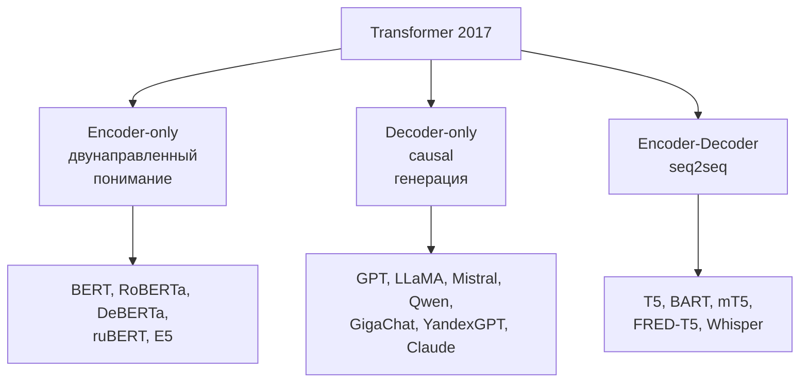

# 5.4 Архитектура Transformer ⭐⭐⭐ («Attention Is All You Need», 2017)

## Общая схема (encoder-decoder, перевод)
```
                 ENCODER (×N)                                DECODER (×N)
                                                         Output probabilities
                                                                 ▲
                                                             Softmax
                                                                 ▲
                                                              Linear
                                                                 ▲
                                                    ┌──────────────────────────┐
                                                    │   Add & Norm             │
                                                    │   Feed Forward           │
    ┌─────────────────────────┐                     │   Add & Norm             │
    │   Add & Norm            │                     │   Cross-Attention ◀──────┼── K,V из энкодера
    │   Feed Forward          │──────── K, V ──────▶│   (Q из декодера)        │
    │   Add & Norm            │                     │   Add & Norm             │
    │   Multi-Head            │                     │   Masked Multi-Head      │
    │   Self-Attention        │                     │   Self-Attention         │
    └─────────────────────────┘                     └──────────────────────────┘
              ▲                                                  ▲
     Embedding + Positional                            Embedding + Positional
              ▲                                                  ▲
        Inputs (src)                                 Outputs (сдвинуты вправо)
```
Оригинал: $N=6$, $d_{model}=512$, $h=8$, $d_{ff}=2048$, dropout 0.1, label smoothing 0.1, Adam + warmup.

## Блок энкодера подробно
```
 x ─┬─▶ [Multi-Head Self-Attention] ─▶ Dropout ─▶ (+) ─▶ LayerNorm ─┬─▶ [FFN] ─▶ Dropout ─▶ (+) ─▶ LayerNorm ─▶
    └───────────────── residual ───────────────────┘                └───────── residual ──────┘
                                         (Post-LN, оригинал)
```

### 1. Multi-Head Self-Attention
**Смешивает информацию между токенами.** → [[5.1 Self-Attention]], [[5.2 Multi-Head Attention и маски]]

### 2. Position-wise Feed-Forward Network (FFN / MLP)
$$\text{FFN}(x) = W_2\,\varphi(W_1x + b_1) + b_2,\quad d_{ff} = 4\,d_{model}$$
Применяется **к каждому токену независимо** (одни веса). **Обрабатывает информацию внутри токена.** Считается, что FFN хранит **«знания» (key-value память)**. ~2/3 параметров модели.
Современные LLM: **SwiGLU** $\text{FFN}(x) = W_2(\text{Swish}(W_1x)\odot W_3x)$, $d_{ff}\approx\frac83d_{model}$.

### 3. Residual connections
$x + \text{Sublayer}(x)$ → градиенты текут напрямую, можно строить глубокие сети. Взгляд **«residual stream»**: каждый блок читает из общего потока и дописывает в него.

### 4. LayerNorm
Стабилизирует обучение. Pre-LN vs Post-LN → [[4.6 Нормализация#Pre-LN vs Post-LN (трансформеры)]].

## Декодер — отличия
1. **Masked** self-attention (causal mask) — нельзя смотреть вперёд.
2. **Cross-attention**: Q — из декодера, K/V — из выхода энкодера.
3. Выход → Linear (часто с весами, **связанными (tied)** с входными эмбеддингами) → softmax по словарю.

## Обучение и инференс
- **Обучение**: teacher forcing — на вход декодеру правильный выход, сдвинутый вправо (`<s> I love` → предсказываем `I love ML`). Все позиции параллельно.
- **Инференс**: авторегрессионно, токен за токеном (с KV-кэшем) → [[5.11 Генерация и декодирование]].

## Считаем параметры одного слоя (без bias)
- Attention: $4d^2$
- FFN: $2\cdot d\cdot 4d = 8d^2$
- **Итого ≈ $12d^2$ на слой**; модель ≈ $12\,N\,d^2$ + эмбеддинги $|V|\cdot d$.
- Пример GPT-3: $N=96$, $d=12288$ → $12\cdot96\cdot12288^2\approx174$B ✓ (175B).

## Три семейства

| | Encoder-only | Decoder-only | Encoder-Decoder |
|---|---|---|---|
| Внимание | двунаправленное | causal | энкодер bi + декодер causal + cross |
| Предобучение | MLM | next token (CLM) | span corruption / denoising |
| Задачи | классификация, NER, эмбеддинги, поиск | генерация, чат, всё через промпт | перевод, суммаризация |
| Подробнее | [[5.6 BERT и encoder-модели]] | [[5.7 GPT и decoder-модели]] | [[5.8 T5 и encoder-decoder]] |

## Почему трансформер победил
Параллелизм на GPU → масштабирование на огромные данные; прямые связи между всеми токенами; универсальность (текст, картинки, звук, белки); **предсказуемое масштабирование** (scaling laws).
Минусы: $O(n^2)$ по длине; нужно много данных (слабые индуктивные смещения).

## ❓ Вопросы
- Нарисуй архитектуру трансформера и объясни каждый блок.
- Зачем FFN, если есть attention?
- Зачем residual connections и LayerNorm?
- Чем декодер отличается от энкодера?
- Посчитай число параметров слоя.
- Как трансформер обучается параллельно, а генерирует последовательно?
