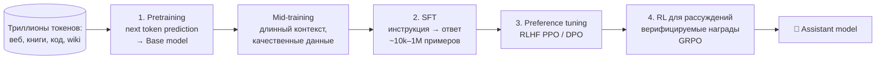

# 5.9 Обучение LLM: Pretrain → SFT → RLHF/DPO ⭐⭐⭐



## 1. Предобучение (Pretraining)
- Цель — next token prediction на огромном корпусе.
- **Данные**: фильтрация качества (классификаторы, эвристики), **дедупликация** (MinHash), удаление токсичности/PII, смешение доменов (веб, код, математика, книги, многоязычные).
- Результат — **base model**: продолжает текст, но не следует инструкциям.
- **Perplexity** — основная метрика: $PPL = \exp\left(-\frac1T\sum\log p(x_t|x_{<t})\right)$ — «среди скольких токенов модель в среднем колеблется».

### Scaling laws ⭐
Лосс падает **степенным законом** от параметров $N$, данных $D$ и вычислений $C\approx 6ND$ FLOPs.
- **Kaplan (2020)**: больше параметров важнее.
- **Chinchilla (2022)**: при фиксированном compute оптимально $D\approx20N$ токенов (модели были недообучены). Chinchilla 70B на 1.4T > Gopher 280B.
- Сейчас обучают **сильно больше**, чем Chinchilla-оптимум (LLaMA-3 8B на 15T токенов), т.к. важна стоимость **инференса**.

### Память при обучении ⭐
Для модели с $N$ параметрами, mixed precision + Adam:
| Что | Байт/параметр |
|---|---|
| Веса BF16 | 2 |
| Градиенты BF16 | 2 |
| Master-веса FP32 | 4 |
| Adam m, v FP32 | 4 + 4 |
| **Итого** | **≈16 байт/параметр** + активации |
7B модель → ~112 GB только на состояние → нужно шардирование.

### Параллелизм
```
 Data Parallel (DDP)   : копия модели на каждом GPU, разные батчи, all-reduce градиентов
 ZeRO / FSDP           : шардируем оптимизатор (1), + градиенты (2), + параметры (3)
 Tensor Parallel       : режем матрицы слоёв между GPU (Megatron)
 Pipeline Parallel     : разные слои — на разных GPU, микробатчи
 Sequence/Context Par. : режем по длине последовательности
 Expert Parallel       : эксперты MoE на разных GPU
 → 3D-параллелизм = DP × TP × PP
```

## 2. SFT (Supervised Fine-Tuning / Instruction tuning)
Дообучаем на парах **(инструкция → хороший ответ)** с тем же CE-лоссом, но **только по токенам ответа** (промпт маскируется). Chat-шаблон с ролями system/user/assistant. Данные: ручная разметка, синтетика от сильных моделей. **Качество > количество** (LIMA: 1000 примеров).

## 3. Выравнивание по предпочтениям (Alignment)
Цель: helpful, honest, harmless (HHH).

### RLHF (InstructGPT) ⭐
```
 Шаг A: собрать сравнения: промпт → 2+ ответа → человек выбирает лучший
 Шаг B: Reward Model r(x,y) — обучаем на парах (Bradley-Terry):
        L = −log σ(r(x, y_win) − r(x, y_lose))
 Шаг C: PPO — оптимизируем политику π на максимум награды
        с KL-штрафом к SFT-модели:
        max E[r(x,y)] − β·KL(π(y|x) ‖ π_SFT(y|x))
```
KL-штраф нужен против **reward hacking** (модель находит лазейки в RM и деградирует) и чтобы не уйти далеко от осмысленного языка.
❌ Сложно: 4 модели в памяти (policy, reference, reward, value/critic), нестабильно.

### DPO (Direct Preference Optimization, 2023) ⭐
Аналитически показано, что можно **обойтись без RM и RL** — оптимизировать политику напрямую на парах предпочтений:
$$\mathcal L_{DPO} = -\log\sigma\Big(\beta\log\frac{\pi_\theta(y_w|x)}{\pi_{ref}(y_w|x)} - \beta\log\frac{\pi_\theta(y_l|x)}{\pi_{ref}(y_l|x)}\Big)$$
✅ Просто, стабильно, как обычное обучение с учителем. Варианты: IPO, KTO (без пар, бинарный фидбек), ORPO (SFT+предпочтения сразу), SimPO.

### RLAIF / Constitutional AI
Предпочтения размечает не человек, а LLM по набору принципов («конституции»).

## 4. RL для рассуждений (reasoning models)
o1, DeepSeek-R1: RL на задачах с **проверяемым ответом** (математика, код, тесты) → модель учится длинным цепочкам рассуждений, самопроверке. **GRPO** (DeepSeek): без critic, преимущество = награда относительно среднего по группе ответов на тот же промпт. **Test-time compute scaling**: больше «думает» — лучше ответ.

## Оценка LLM
- Бенчмарки: MMLU (знания), GSM8K/MATH (математика), HumanEval/SWE-bench (код), HellaSwag, ARC, TruthfulQA, Arena (Elo от людей); 🇷🇺 **MERA**, ruMMLU.
- **LLM-as-a-judge**, human eval, A/B.
- Проблемы: **контаминация** тестов в обучающих данных, галлюцинации.

## Проблемы LLM
**Галлюцинации**, устаревшие знания (cutoff) → [[5.15 RAG и агенты|RAG]]; prompt injection, jailbreak; bias; sycophancy (поддакивание); стоимость.

## ❓ Вопросы
- Опиши этапы обучения ChatGPT-подобной модели.
- Как работает RLHF? Зачем KL-штраф? Что такое reward hacking?
- DPO vs RLHF?
- Что такое scaling laws / Chinchilla?
- Сколько памяти нужно для обучения 7B модели?
- Что такое perplexity?
