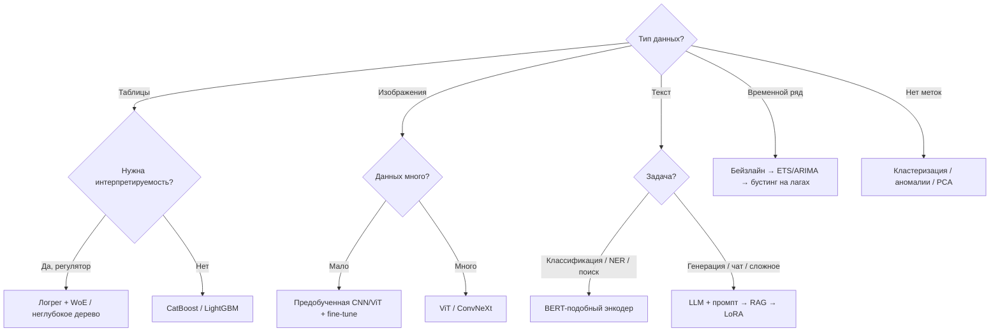

# 6.3 📋 Шпаргалка — прочитать за час до собеседования

## 🧮 Формулы, которые нужно помнить
| | |
|---|---|
| МНК | $w = (X^\top X)^{-1}X^\top y$; Ridge: $+\lambda I$ |
| Сигмоида | $\sigma(z) = \frac1{1+e^{-z}}$, $\sigma' = \sigma(1-\sigma)$ |
| Log-loss | $-[y\log p + (1-y)\log(1-p)]$, $\nabla_w = X^\top(p-y)/n$ |
| Softmax | $\frac{e^{z_i}}{\sum e^{z_j}}$; CE+softmax: $\nabla_z = p - y$ |
| Bias-variance | $\text{Err} = \text{Bias}^2 + \text{Var} + \sigma^2$ |
| Precision / Recall | $\frac{TP}{TP+FP}$ / $\frac{TP}{TP+FN}$; F1 $= \frac{2PR}{P+R}$ |
| AUC | $P(s_+ > s_-)$; Gini $= 2\,AUC - 1$ |
| Gini impurity / энтропия | $1-\sum p_k^2$ / $-\sum p_k\log p_k$ |
| GBM | $r_i = -\partial L/\partial F$; $F_m = F_{m-1} + \eta h_m$ |
| XGB лист | $w^* = -G/(H+\lambda)$ |
| Bootstrap OOB | $\approx 1/e \approx 37\%$ |
| Свёртка | $O = \lfloor(I-K+2P)/S\rfloor+1$; params $= C_{out}(C_{in}K^2+1)$ |
| Adam | $m = \beta_1m + (1-\beta_1)g$, $v = \beta_2v + (1-\beta_2)g^2$, $w \mathrel{-}= \eta\hat m/(\sqrt{\hat v}+\varepsilon)$ |
| He / Xavier | $\text{Var}(w) = 2/n_{in}$ / $2/(n_{in}+n_{out})$ |
| LayerNorm | $\gamma\frac{x-\mu}{\sigma}+\beta$ по признакам объекта |
| Attention | $\text{softmax}(QK^\top/\sqrt{d_k})V$ |
| Параметры слоя трансформера | $\approx 12d^2$ ($4d^2$ attention + $8d^2$ FFN) |
| Обучение FLOPs | $\approx 6ND$ |
| Память Adam mixed precision | $\approx 16$ байт/параметр |
| KV-cache | $2\cdot L\cdot h_{kv}\cdot d_h\cdot n\cdot\text{bytes}$ |
| LoRA | $W_0 + \frac{\alpha}{r}BA$, $B=0$ init, $r(d+k)$ параметров |
| DPO | $-\log\sigma(\beta[\log\frac{\pi(y_w)}{\pi_{ref}(y_w)} - \log\frac{\pi(y_l)}{\pi_{ref}(y_l)}])$ |
| Perplexity | $\exp(\text{средний CE})$ |
| Chinchilla | $D \approx 20N$ токенов |

## 🔑 Ключевые «почему»
- **L1 → нули**: углы ромба на осях.
- **Деревьям не нужен скейлинг**: пороги инвариантны к монотонным преобразованиям.
- **RF ↓ variance, бустинг ↓ bias**.
- **RF не переобучается от числа деревьев, бустинг — да**.
- **CE, а не MSE для классификации**: выпуклость + нет затухания градиента сигмоиды.
- **ReLU > sigmoid**: нет насыщения, градиент 1.
- **Residual**: градиент течёт по identity ($I + \partial F$).
- **LN в трансформерах**: не зависит от батча и длины.
- **AdamW**: weight decay не делится на $\sqrt v$.
- **Warmup**: статистики Adam не устоялись, большие апдейты на старте дестабилизируют.
- **$\sqrt{d_k}$**: дисперсия $q\cdot k$ = $d_k$ → насыщение softmax.
- **Позиции**: attention эквивариантен к перестановкам.
- **Causal mask**: параллельное обучение next-token без подглядывания.
- **Multi-head**: разные типы связей в разных подпространствах.
- **KV-cache**: прошлые K,V не меняются.
- **Decode memory-bound**: каждый шаг читает все веса ради 1 токена.
- **LoRA без задержки**: $BA$ сливается в $W$.
- **KL в RLHF**: против reward hacking.
- **RAG для знаний, FT для поведения**.

## 🌳 Дерево выбора модели


## 🗓 Хронология (для «расскажи историю»)
```
1958 Перцептрон → 1986 Backprop → 1995 SVM → 1997 LSTM → 1998 LeNet → 2001 Random Forest
→ 2001 Gradient Boosting → 2012 AlexNet → 2013 Word2Vec → 2014 GAN, Seq2Seq, Attention, Adam
→ 2015 ResNet, BatchNorm → 2016 XGBoost, LayerNorm → 2017 Transformer, LightGBM, CatBoost
→ 2018 BERT, GPT-1 → 2019 GPT-2, T5 → 2020 GPT-3, ViT, DDPM, scaling laws → 2021 CLIP, LoRA
→ 2022 ChatGPT (RLHF), Chinchilla, FlashAttention, Stable Diffusion → 2023 LLaMA, GPT-4, DPO, Mamba
→ 2024 o1 (reasoning) → 2025 DeepSeek-R1 (GRPO), агенты
```

## 🎤 Советы на само интервью
1. Не знаешь — **рассуждай вслух** от первых принципов, а не молчи.
2. Сначала **простой ответ / бейзлайн**, потом усложнение.
3. Всегда упоминай **метрику, валидацию и бизнес-смысл**.
4. В system design: уточни задачу → данные → бейзлайн → модель → метрики → деплой → мониторинг.
5. Подготовь 2-минутный рассказ о проекте с **цифрами**.
6. Задай свои вопросы: команда, задачи, стек, как измеряют успех.

**Удачи! 🍀**
