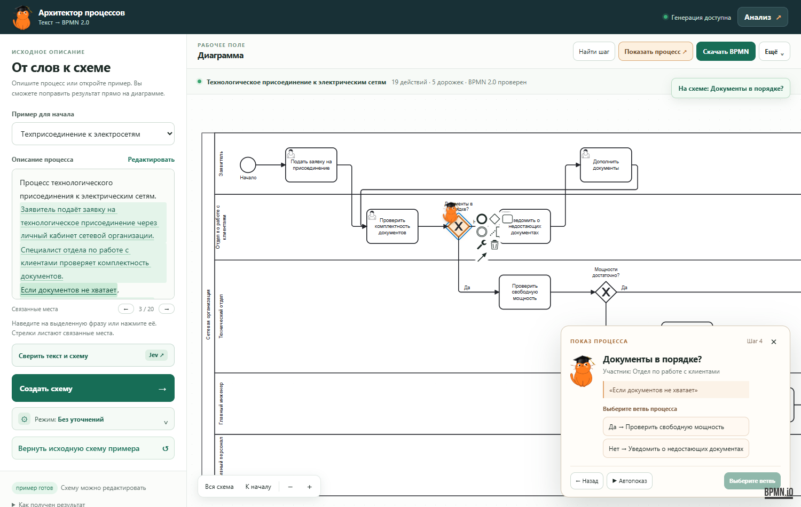

# Архитектор процессов

**Превращает описание бизнес-процесса в редактируемую BPMN-схему и помогает проверить, не потерялось ли что-то по дороге.**

Это прототип для задачи «Архитектор BPMN-диаграмм» EnergyHack 2026. Вы пишете, кто что делает и при каких условиях, или загружаете документ; приложение строит диаграмму с пулами и дорожками участников, действиями, развилками с веткой «иначе», параллельными операциями, циклами доработки, сроками и эскалациями. Файл проходит проверку по XSD BPMN 2.0, содержит координаты (DI) и открывается в [bpmn.io](https://demo.bpmn.io/).

Схему можно править на холсте и словами («добавь согласование юристом после шага 3»), проверить линтером, сформировать регламент (DOCX), найти узкие места и посчитать Monte Carlo, построить RACI и тест-сценарии, исполнить процесс по шагам и работать над схемами командой.

## Суть проекта для презентации

**Проблема.** Описание процесса обычно живёт в тексте: роли и условия приходится переносить на схему вручную, а пропущенные шаги, противоречия и выдуманные моделью детали трудно заметить. **Наше решение** превращает текст или документ в редактируемый BPMN 2.0 и даёт аналитику инструменты, чтобы проверить результат, обсудить его с командой и применить дальше.

| Преимущество | Как это работает | Польза |
|---|---|---|
| Стандартный результат, а не картинка | Модель выделяет структуру процесса; сборщик создаёт BPMN XML с дорожками, шлюзами, условиями и координатами. Файл проверяется по XSD и открывается в bpmn.io. | Схему можно править и передавать в другие BPMN-инструменты. |
| Объяснимость каждого шага | Фразы исходного текста связаны с блоками: при наведении или нажатии блок подсвечивается; карточка показывает цитату, исполнителя и допущения. Раздел «Анализ» показывает пропуски, развилки и факты без основания. | Аналитик видит, откуда взялось действие, и быстрее находит спорные места. |
| Человек принимает спорные решения | Режим «С уточнениями» задаёт вопросы вместо догадок. При несовместимых правилах генерация останавливается и показывает обе точные цитаты для выбора приоритета. | Система не скрывает неоднозначность под убедительной диаграммой. |
| Приватность до обращения к модели | Локальные правила и Natasha заменяют найденные персональные данные метками; пользователь видит предпросмотр и может скрыть дополнительные фрагменты. Подозрительные команды внутри документа также отсекаются. | Внешней модели передаётся очищенная версия запроса; чувствительные места можно проверить заранее. |
| Диаграмма превращается в рабочий инструмент | Блоки настраиваются через шестерёнку; доступны линтер, регламент DOCX, RACI, тест-пути, оценка узких мест и Monte Carlo. Отдельно можно пошагово исполнить процесс с кодом сервисных задач и действиями людей. | Из одной схемы получаются материалы для согласования, проверки и работы. |
| Совместная работа с разграничением прав | Личный редактор открыт без регистрации; для общих проектов есть аккаунты, приглашения, роли и версионное сохранение с проверкой разрешённых изменений на сервере. | Команда может работать над одной схемой без потери контроля над правками. |
| Подготовка к отраслевой задаче | Пять шаблонов энергетических процессов, вопросы по типовым рискам и примеры техприсоединения и отключения. | Демонстрация и первые сценарии ближе к реальным процессам энергетики. |
| Понятный показ результата | Минималистичный редактор, мобильная работа с исходным текстом, кот-маскот в пошаговом показе и симуляции; во время ожидания — квиз по ИИ. | Схему проще объяснить заказчику и проверить вместе с ним. |

**Архитектурное отличие:** в основном режиме LLM не пишет XML напрямую. Она возвращает проверяемую структуру процесса (IR), а построение, раскладка, проверка XSD, линтер и экспорт выполняются детерминированно. Ошибки сначала исправляются правилами; если нужно, модель получает конкретные замечания и исправляет IR. Дополнительная модель Jev оценивает смысловую связь отдельных фрагментов текста со схемой и не меняет её автоматически. Подробный конвейер и ограничения описаны ниже.

**Как показать за 3–4 минуты:** откройте готовый процесс без API-ключа; нажмите фразу слева и покажите подсветку шага; откройте «Анализ → Аудит» и «Показать процесс»; во вкладке «Инструменты» раздела «Анализ» покажите линтер, регламент или RACI; скачайте BPMN и откройте его в bpmn.io. Если модель настроена и доступна, отдельно покажите генерацию собственного текста, выбор при противоречии и предпросмотр персональных данных. Готовый пример демонстрирует редактор и формат файла, но сам по себе не доказывает качество генерации моделью.

Для слайдов достаточно этого раздела вместе с разделами «Безопасность и достоверность», «Как устроено решение» и «Что важно знать»; остальные части README — инструкция по кнопкам, запуску и проверке.

## Попробовать за минуту

Для готового демо **ключ модели не нужен**. Понадобится Python 3.10+.

**Windows PowerShell** — команды из корня репозитория:

~~~powershell
.\run.bat
~~~

**Linux / macOS:**

~~~bash
python3 -m venv .venv
source .venv/bin/activate
./run.sh
~~~

Скрипт установит Python-зависимости и запустит сайт на **http://127.0.0.1:8080**. Откройте адрес и нажмите **«Открыть демо-процесс»** — регистрация для личной работы со схемами не нужна. Вход требуется только для команд, приглашений и общих проектов. Пользователи хранятся локально в `data/app.db`, пароли — только хэш scrypt. Если нужен обязательный вход на всём сайте, задайте `REQUIRE_LOGIN=true` в .env. Если порт 8080 занят, для Linux/macOS можно задать переменную PORT; на Windows после установки зависимостей запустить <code>.\.venv\Scripts\python.exe -m uvicorn server:app --host 127.0.0.1 --port 8090</code> и открыть порт 8090.

При первом открытии вкладки появляется короткая заставка Data Science Club с котом и названием проекта. Она сама исчезает примерно через две секунды; можно нажать **«Пропустить»** или Esc. Повторная загрузка той же вкладки заставку не показывает, а при системной настройке уменьшенной анимации она отключена. Кнопки и панели открываются с короткими плавными переходами, не задерживая работу со схемой.

**Через Docker Desktop** из корня репозитория:

~~~powershell
docker compose up --build -d
~~~

Откройте **http://127.0.0.1:8080**. Без файла .env доступно готовое демо; если .env создан, Docker Compose передаст его настройки модели контейнеру. Аккаунты, команды и общие проекты хранятся в томе `bpmn_team_data` и переживают пересборку контейнера. Чтобы остановить сайт, выполните `docker compose down`. Если 8080 уже занят, сначала задайте другой локальный порт, например `$env:APP_PORT=8090`, и откройте http://127.0.0.1:8090. При сборке Compose использует доступное зеркало Python-пакетов; при необходимости его можно заменить переменной `PIP_INDEX_URL`.

### Показать сайт другим через ngrok

Понадобится [аккаунт ngrok и его authtoken](https://dashboard.ngrok.com/get-started/your-authtoken). Запишите токен в **локальный** файл .env в корне проекта строкой `NGROK_AUTHTOKEN=ваш_токен`. Файл .env исключён из Git. Для генерации чужих текстов через модель заполните в нём настройки выбранного провайдера из раздела ниже.

~~~powershell
docker compose --profile share up --build -d
docker compose logs ngrok
~~~

В логах ngrok найдите публичный адрес `https://…ngrok…` и отправьте его зрителям. Если используете локальный порт 8090, перед запуском `share` снова задайте `$env:APP_PORT=8090` в этой консоли. Адрес работает, пока запущены ваш компьютер, Docker Desktop и контейнер ngrok. Для остановки публичного доступа выполните `docker compose --profile share down`. Профиль `share` запускается только по этой команде; обычный `docker compose up` оставляет сайт локальным. Публичная ссылка даёт доступ и к генерации, поэтому учитывайте расход своего ключа модели.

Что показать за одну минуту:

1. Нажмите на выделенную фразу слева — соответствующий блок на схеме подсветится.
2. Нажмите **«Показать процесс»** — кот проведёт по шагам; на развилке выберите путь.
3. Откройте **«Анализ → Аудит»** — там возможные пропуски в тексте и проверка развилок.
4. Нажмите **«Скачать BPMN»** и откройте файл в [demo.bpmn.io](https://demo.bpmn.io/).

Можно выбрать и другой готовый пример в левом списке. Кнопка **«Открыть готовую схему примера»** показывает его без вызова модели.

## Создать свою схему

Для генерации по **новому тексту** нужен доступ к LLM. Создайте в корне проекта файл .env на основе .env.example:

~~~powershell
Copy-Item .env.example .env
~~~

Заполните провайдер, модель и ключ. Например, для OpenRouter:

~~~dotenv
LLM_PROVIDER=openai
LLM_BASE_URL=https://openrouter.ai/api/v1
LLM_MODEL=anthropic/claude-opus-5.5
LLM_API_KEY=ваш_ключ_OpenRouter
JEV_ENABLED=true
~~~

Это **пример настройки**, а не обязательная модель: модель задаётся только конфигурацией, код менять не нужно. Все обращения к LLM идут через один адаптер `complete(messages, schema)` в `backend/app/llm/client.py`:

| Где модель | Настройки в .env |
|---|---|
| **Yandex AI Studio** | `LLM_PROVIDER=yandex`, `YANDEX_FOLDER_ID=b1g…`, `LLM_MODEL=gpt-oss-120b/latest` (или `qwen3-235b-a22b-fp8/latest`, `yandexgpt/latest`), `LLM_API_KEY=` API-ключ или IAM-токен |
| **gpt-oss-120b / Qwen3** через vLLM, Ollama, LM Studio, OpenRouter | `LLM_PROVIDER=openai`, `LLM_BASE_URL=http://host:8000/v1`, `LLM_MODEL=openai/gpt-oss-120b` или `Qwen/Qwen3.6-35B-A3B` |
| Google Gemini / Anthropic Claude | `LLM_PROVIDER=gemini` или `anthropic` + `LLM_API_KEY` |

Дополнительно: `LLM_JSON_MODE` — какой структурированный вывод запрашивать (если endpoint не поддерживает json_schema, адаптер сам перейдёт на json_object, затем на JSON по промпту); `LLM_REASONING_EFFORT` — глубина рассуждений gpt-oss; `LLM_REPAIR_MODEL` — отдельная модель для самоисправления; `MAX_REPAIRS` — число раундов самоисправления; `LLM_ONPREM_ONLY=true` — разрешить только локальную модель; `PROMPT_VERSIONS` — закрепить версии промптов. Все поля описаны в [.env.example](.env.example). Jev работает только при включённом JEV_ENABLED и подключении через OpenRouter. Файл .env исключён из Git — **не добавляйте ключи в README или исходный код**.

Если подключение не работает, проверьте его из корня проекта:

~~~powershell
.\.venv\Scripts\python.exe scripts/check_llm.py
~~~

На Linux/macOS вместо пути к .venv можно использовать python3. Изменения .env сервер подхватывает без перезапуска.

Теперь введите описание процесса слева (или загрузите документ txt, docx, pdf, расшифровку интервью кнопкой **«Загрузить документ»** под полем описания) и нажмите **«Создать схему»**. По умолчанию приложение строит результат сразу, **без уточняющих вопросов**. Кнопка **«Режим: Без уточнений»** позволяет выбрать:

| Режим | Когда использовать |
|---|---|
| Без уточнений | Быстро получить схему и затем проверить спорные места. Допущения видны на схеме аннотациями. Это режим по умолчанию. |
| С уточнениями | Сначала увидеть вопросы к заказчику (кто исполнитель, какое условие, что «иначе», чем заканчивается) и допущения, при необходимости ответить, затем построить схему. |
| Через генерацию кода | Режим первого прототипа: модель составляет план и пишет по нему Python-код схемы на DIAGRAM API. |
| Прямая генерация кода | Технический режим: модель сразу создаёт код схемы, минуя отдельный план. |

Для типовых процессов энергетики есть **5 отраслевых шаблонов** — список **«Отраслевой шаблон (энергетика)»** под полем описания: техприсоединение, аварийное отключение, плановый ремонт, наряд-допуск, закупка.

### Во время ожидания

Пока модель строит схему, область диаграммы показывает **мини-квиз Data Science Club** вместо пустого экрана ожидания. В нём 35 несложных вопросов об истории и применениях ИИ: каждый раз они идут в случайном порядке, у каждого по три варианта ответа. После выбора появятся правильный ответ, короткое объяснение и ссылка на источник факта. Можно перейти к следующему вопросу или начать новый круг; когда схема готова, квиз закрывается сам.

Вопросы хранятся в [frontend/wait-quiz.js](frontend/wait-quiz.js), поэтому подборку легко расширить. На телефоне сайт переходит к квизу во время ожидания и возвращает к форме ответов, если выбран режим «С уточнениями».

## Что можно сделать со схемой

### Проверить связь с исходным текстом

После построения в описании выделяются фразы, привязанные к шагам. Наведите курсор на фразу или нажмите её — связанный блок подсветится **целиком**, а не только по краю. Выбор блока показывает его основание в тексте. На телефоне связанные места листаются стрелками или горизонтальным жестом.

В **«Анализ → Аудит»** находятся два вида подсказок:

- **Текст:** фрагменты описания, для которых не нашлось прямой привязки к шагу. Нажатие возвращает к нужному месту текста.
- **Развилки:** исходящие ветви каждого шлюза, их подписи и следующие шаги. Нажатие ведёт к шлюзу на схеме. Для параллельных ветвей подписи не считаются обязательными.

Это **места для проверки человеком**, а не автоматический вывод, что схема неправильная. Если шаг верный, но цитата не привязана, раскройте **«Точные цитаты и ручная привязка»**: выберите блок и добавьте точную фразу из описания.

### Посмотреть и проиграть процесс

**«Показать процесс»** — режим для объяснения схемы заказчику или судье: кот переходит от шага к шагу, показывает исполнителя и исходную фразу. Есть кнопки «Назад», «Далее» и автопоказ. На развилке можно выбрать путь; для параллельного шлюза выбор определяет только порядок просмотра.

**«Ещё → Проиграть процесс»** — симуляция маршрутов на диаграмме bpmn.io. Кот заменяет обычный движущийся маркер; параллельные ветви в этом режиме запускаются одновременно. Это наглядная проверка маршрута, **не расчёт длительности и не исполнение бизнес-процесса**.

### Исправить и скачать

- **Править на холсте:** через **«Ещё → Инструменты рисования»** можно добавлять и соединять элементы.
- **Изменить словами:** напишите просьбу в блоке «Изменить словами», например «добавь согласование с юристом после шага 3». Модель меняет структуру процесса (IR), а не XML; учитывается текущий BPMN-файл, включая ручные правки. После правки показывается diff «до/после»: новое подсвечено зелёным, изменённое — оранжевым.
- **Свойства блока по шестерёнке ⚙:** описание, роль, исполнитель, сроки, SLA, документы, RACI, условия веток. Справочник исполнителей и ролей хранится в .bpmn и не уходит в модель.
- **Открыть свой BPMN:** **«Ещё → Открыть BPMN-файл»** загружает .bpmn или .xml.
- **Проверить:** после изменений обновляются замечания о структуре. Дополнительные действия — «Проверить схему», «Проверить формат» и «Переразместить» — находятся в «Ещё».
- **Скачать:** основная кнопка выдаёт .bpmn; SVG и PNG доступны в «Ещё». Формат BPMN 2.0 проверяется по XSD-схеме стандарта.

Для большой схемы есть **«Найти шаг»** (Ctrl+K), выделение действий участника, кнопки **«Вся схема»** и **«К началу»**. В **«Анализ → История»** доступны до 20 версий, пока открыта текущая вкладка браузера.

### Исполнить процесс

У сервисной задачи может быть код (безопасное подмножество Python, интерпретатор с обходом AST и лимитами), у веток развилки — проверки. **«Выполнить процесс»** исполняет код, выбирает ветки по проверкам и ждёт людей на их шагах. Каждый шаг формирует документ о работе (DOCX); исполнитель-человек вводит данные и сам формирует документ или прикрепляет файл. Итог можно скачать архивом.

### Работать командой

Регистрация и вход, команды с приглашениями по почте, логину, ID или ссылке; приглашённый может принять или отклонить. Глава команды сам настраивает роли: права (просмотр, тексты и документы, схема, ИИ, код, запуск, проекты, участники, роли) и видимые проекты. Без роли человек ничего не видит. Общие проекты сохраняются версиями, а сервер проверяет каждое сохранение: например, роль без права на структуру не может изменить схему.

## Чем помогает аналитика

Карточка выбранного шага показывает **исходную цитату, исполнителя, срок, документы и допущение**. Эти данные можно изменить; они сохраняются внутри BPMN-файла и читаются при повторном импорте. Если модель добавила действие без прямого основания в тексте, оно должно быть отмечено как допущение, а не выдано за факт.

Вкладка **«Риски»** задаёт проверочные вопросы по типичным ситуациям энергетического процесса: неполный комплект документов, истечение срока, недостаток мощности или отказ, замечания после осмотра, отключение и восстановление питания. Она не придумывает обязательные ветви автоматически и не утверждает соответствие нормативам.

Вкладка **«Инструменты»** собирает инструменты аналитика (подробно — в [docs/features.md](docs/features.md)):

- **Линтер** (20 проверок) с кнопкой «исправить автоматически».
- **Регламент и СОП** (Markdown, DOCX) и объяснение процесса простым языком.
- **Аналитика:** критический путь, тепловая карта шагов, Monte Carlo (среднее, p90, загрузка участников, доли ветвей), сравнение «как есть / как будет», оценка длительностей моделью и рекомендации (помечены как рекомендации, а не факты).
- **SLA и эскалации** — граничные таймеры BPMN.
- **RACI** (CSV, XLSX), **тест-пути** (CSV, Markdown), экспорт JSON IR и BPMN с пометкой совместимости с Camunda 8.
- **Журнал действий ИИ:** по каждому запросу модель, версии промптов, токены, время, ошибки, число исправлений и сколько данных замаскировано; экспорт JSON. Секреты в журнал не пишутся.

**Jev** — необязательная смысловая проверка через OpenRouter. Кнопка «Сверить текст и схему» сравнивает цитаты с названиями шагов; кнопка в «Анализ → Аудит» оценивает спорные требования и ветви. Проценты появляются рядом с фрагментами во вкладке «Текст» и у строк маршрутов во вкладке «Развилки». Если фрагментов для проверки нет, приложение само откроет «Развилки». Низкая оценка означает **«посмотрите вручную»**, а не доказанную ошибку. Jev не меняет схему. Ему отправляются короткие фрагменты текста и названия шагов, а не весь BPMN-файл.

## Безопасность и достоверность

**Персональные данные не попадают в модель.** Каждый запрос к LLM (извлечение структуры, код,
самоисправление, правки в диалоге, объяснение, оценка длительностей, рекомендации, проверка
противоречий) проходит через одну точку — `Pipeline._ask` с `PrivacyGuard` из
`backend/app/privacy.py`; если у запроса нет своего guard, он создаётся из самого запроса (fail
closed). Jev маскирует свои фрагменты тем же `PrivacyGuard`. Отключить маскирование настройкой
нельзя. До отправки персональные данные
заменяются метками `[ФИО_1]`, `[ТЕЛЕФОН_1]`, `[АДРЕС_1]`…; ответ модели возвращается в исходный вид
на сервере, поэтому на схеме — настоящие значения, а цитаты совпадают с текстом. Уровни защиты:

1. правила для идентификаторов с проверкой контрольных сумм: ИНН, ОГРН, номера карт (Луна), а также
   телефоны, e-mail, паспорт, СНИЛС, счета, лицевые счета, адреса, даты рождения, кадастровые номера
   и номера договоров;
2. локальная NER-модель Natasha для ФИО (работает без сети) и правила для ФИО с инициалами и отчеством;
3. аналитик: «Что увидит модель» под полем описания показывает обе версии текста; любой фрагмент
   можно скрыть вручную, спорные находки (ФИО, адрес, номер документа) — отправить как есть;
   идентификаторы скрываются всегда;
4. последний рубеж: перед каждым запросом правила проверяют исходящее сообщение ещё раз.

Справочник исполнителей (имена, должности, контакты), код блоков, шаблоны документов и проверки
веток в модель не отправляются вовсе: модель видит «Исполнитель 1», а настоящие данные
возвращаются по id после ответа. `LLM_ONPREM_ONLY=true` запрещает любые внешние модели.

Журнал `runs/<id>/llm.jsonl` хранит ровно то, что ушло в модель, то есть только метки. Исходный
текст и схема остаются в локальных файлах прогона (`runs/` не попадает в git).

**Текст не может командовать ассистентом.** Невидимые символы (zero-width, bidi, Unicode Tags, в
которых можно спрятать текст для модели) удаляются, а спрятанное сообщение показывается аналитику.
Фразы, обращённые к ИИ («игнорируй предыдущие инструкции», «не показывай аналитику»), скрываются
от модели так же, как персональные данные: опасный текст до неё просто не доходит.

**Противоречия в описании.** Если в тексте два несовместимых правила (например, разные сроки одного
действия), схема не строится. Аналитик видит обе цитаты и выбирает старшее правило; выбор
остаётся сноской на схеме, чтобы правку текста не потеряли. Противоречия ищут два запроса параллельно
(извлечение структуры процесса и отдельная узкая проверка), поэтому ожидание не растёт. Пересказы и пересекающиеся
цитаты модели не блокируют построение.

**Ни один факт без основания.** Сроки, числа (в том числе прописью), даты, ссылки на нормативы и
документы на схеме сверяются с описанием без LLM. Чего нет в тексте — попадает в «Анализ → Обзор →
Факты не из описания» с кнопками «Убрать» и «Оставить как допущение». Кнопка «Проверка фактов»
раскрашивает схему: подтверждено текстом, допущение, нет в описании.

## Как устроено решение

Модель **не пишет BPMN XML**. В основном режиме она только понимает текст и возвращает промежуточное представление процесса (IR, JSON); всё остальное делают проверяемые детерминированные части:

~~~text
текст / документ (txt, docx, pdf, расшифровка интервью; длинные — по частям)
 → маскирование ПДн и команд для ИИ (PrivacyGuard)                              [локально]
 → LLM: извлечение IR по JSON Schema, few-shot  ‖  отдельная проверка противоречий [LLM, параллельно]
 → противоречия есть — стоп, аналитик выбирает старшее правило
 → проверка IR: pydantic-схема, ссылки, линтер, уточняющие вопросы             [детерминированно]
 → сборщик: IR → граф (DIAGRAM API) → пулы, дорожки, шлюзы, default flow,
   conditionExpression, граничные таймеры                                     [детерминированно]
 → автораскладка DI: слева направо, ортогональные связи                       [детерминированно]
 → XSD BPMN 2.0 + семантический валидатор + линтер                             [детерминированно]
 → самоисправление: сначала правила, затем LLM чинит IR (≤ MAX_REPAIRS),
   затем честный отчёт об остаточных проблемах                                [правила → LLM]
 → bpmn-js (просмотр и правка) · .bpmn / SVG / PNG / JSON IR / регламент
~~~

Модель также правит IR по просьбе аналитика, оценивает длительности, объясняет процесс и даёт рекомендации — каждый такой запрос проходит ту же маскировку. Сборка, раскладка, проверки, линтер, симуляция, RACI и тест-пути работают без модели и покрыты тестами.

Режимы **«Через генерацию кода»** сохранены из первого прототипа: там модель пишет Python-код на DIAGRAM API, код выполняется в песочнице, при ошибке модель получает сообщение и исправляет код, а если не помогло — схема собирается из плана детерминированно.

### Приёмы работы с моделью

- **Структурированный вывод.** JSON Schema IR (`/api/ir-schema`) передаётся модели через `response_format: json_schema` (OpenAI-совместимые, Yandex), `responseJsonSchema` (Gemini) или в промпте. Ответ проверяется pydantic-схемой и проверкой ссылок.
- **Устойчивость к слабым моделям.** Типичные ошибки исправляются до валидации: `userTask` → `user_task`, участник указан именем вместо id, `source`/`target` вместо `from`/`to`, висящие запятые, обрезанный JSON, блоки `<think>`. Участник, связанный с процессом обычными стрелками, становится дорожкой, а не отдельным пулом.
- **Few-shot.** В `ir_extract.system` два полных примера: многоучастниковый процесс с XOR, AND и циклом и процесс с внешней организацией.
- **Самоисправление.** Ошибки линтера, валидатора и XSD приходят с id элементов IR и подсказкой; модель возвращает исправленный IR целиком, id сохраняются.
- **Работа с контекстом.** Длинный документ режется по абзацам и обрабатывается частями; IR частей объединяются без дублей. При правке словами модель получает компактный IR и нумерованный список шагов («после шага 3»).
- **Промпты в файлах с версиями.** `backend/app/prompts/<имя>.v<N>.md`; используется последняя версия или закреплённая через `PROMPT_VERSIONS`, версии пишутся в журнал каждого запуска.
- **Без выдумывания.** Цитата-основание для каждого шага сверяется с исходным текстом, факты — с описанием; допущения помечаются на схеме, а в режиме «С уточнениями» вместо догадок задаются вопросы.

Подробности — в [архитектуре](docs/architecture.md), [возможностях](docs/features.md), [ограничениях](docs/limitations.md) и [описании DIAGRAM API](docs/api.md).

## Готовые данные и структура проекта

В [examples/](examples) лежат пять готовых процессов и три описания для проверки защиты. В папках готовых процессов есть исходный текст `input.txt`, эталонный IR `plan.json`, код, `result.bpmn`, PNG/SVG и отчёт проверок `report.json`. IR примеров составлены вручную в формате ответа модели; сохранённые BPMN-файлы собраны по ним детерминированной частью приложения. **Готовый пример не является доказательством качества LLM-генерации.** Прогнать те же описания через модель: `python scripts/build_examples.py --llm --render`, с метриками — `python eval/run_eval.py --render`.

| Пример | Что показывает |
|---|---|
| [Кредит](examples/01_credit) | Несколько участников, проверки, отказ и возврат на доработку |
| [Интернет-магазин](examples/02_eshop) | Параллельная работа, обмен с банком и возвраты |
| [Техприсоединение](examples/03_grid_connection) | Энергетический процесс, дорожки, условия, согласования и подпроцесс |
| [Подбор сотрудника](examples/04_hiring) | Несколько вариантов решения и цикл отбора |
| [Аварийное отключение](examples/05_outage) | Оповещение и восстановление питания |
| [Договор с противоречием](examples/06_conflict) | Только описание: экран выбора старшего правила и сноска на схеме |
| [Заявка с персональными данными](examples/07_personal_data) | Только описание: «Что увидит модель» — ФИО, паспорт, СНИЛС, телефон, адрес скрыты метками |
| [Отравленный регламент](examples/08_poisoned_text) | Только описание: невидимое сообщение в Unicode Tags и видимая команда для ИИ не доходят до модели |

~~~text
backend/app/
  llm/client.py        адаптер LLM: openai-совместимые (vLLM/Ollama/OpenRouter), yandex, gemini, anthropic
  llm/plan.py          IR (pydantic), нормализация ответов, ремонт JSON, компилятор IR → DIAGRAM
  llm/prompts.py       загрузчик версионированных промптов; prompts/*.vN.md — тексты промптов
  pipeline.py          оркестрация: ПДн → IR ‖ противоречия → проверка → сборка → самоисправление → отчёт
  privacy.py           PrivacyGuard: ПДн (правила + Natasha), команды для ИИ, невидимые символы
  conflicts.py         противоречия: проверка цитат, решения аналитика, сноски на схеме
  facts.py             факты на схеме, которых нет в описании (сроки, числа, нормативы, документы)
  jev.py, insights.py  смысловая проверка Jev, карточки и аудит связи текста со схемой
  ir/                  линтер и автоисправления, аналитика и Monte Carlo, движок токенов, регламент,
                       diff версий, слияние частей документа, BPMN → IR
  bpmn/                DIAGRAM API, валидатор, раскладка, сериализатор, XSD OMG, импорт, Camunda 8
  run/                 безопасный интерпретатор кода блоков, запуск процесса, документы DOCX
  collab/              аккаунты (scrypt), команды, роли с правами, приглашения, проекты
  docimport.py · runlog.py · tools_api.py · main.py · templates/ (отраслевые шаблоны IR)
frontend/              bpmn-js без шага сборки: связь текста со схемой, аудит, показ, симуляция,
                       privacy.js, conflicts.js, fact-check.js, toolkit.js («Инструменты»),
                       block-editor.js (⚙), process-run.js, auth.js, team.js, wait-quiz.js, intro.js
examples/ · eval/ · scripts/ · tools/ (рендер в bpmn-js, браузерные тесты) · docs/
Dockerfile и compose.yaml  сборка и запуск сайта с необязательным туннелем ngrok
~~~

Фронтенд уже содержит собранные библиотеки: **Node.js не нужен для обычного запуска сайта**. Он нужен для отдельных проверок и пересборки браузерных зависимостей.

## Проверка проекта

Из корня репозитория:

~~~powershell
.\.venv\Scripts\python.exe -m pytest backend/tests -q
~~~

Для браузерных сценариев нужен Node.js, зависимости из tools/ и установленный Chrome. Сценарии работают с тестовым сервером без модели:

~~~powershell
cd tools
npm ci
cd ..
python backend/tests/serve_ui_fixture.py                     # сервер на 127.0.0.1:8094
node tools/smoke-ui.mjs http://127.0.0.1:8094                # основной сценарий
node tools/smoke-block-editor.mjs http://127.0.0.1:8094      # шестерёнка → свойства → XML → IR
node tools/smoke-process-run.mjs http://127.0.0.1:8094       # код, проверки, запуск, документы
# команды и вход: REQUIRE_LOGIN=true UI_PORT=8095 python backend/tests/serve_ui_fixture.py
node tools/smoke-teams.mjs http://127.0.0.1:8095
~~~

Дополнительно можно запустить офлайн-оценку построения по эталонным планам:

~~~powershell
.\.venv\Scripts\python.exe -X utf8 eval/run_eval.py --offline
~~~

Полная оценка через модель использует текущие настройки .env; параметры и метрики описаны в [eval/run_eval.py](eval/run_eval.py). Журналы запросов и промежуточных результатов сохраняются в runs/ и не включаются в Git.

## Что важно знать

- **Проверка XSD подтверждает формат файла, но не полноту бизнес-процесса.** Подсказки аудита и Jev также требуют решения аналитика.
- Схема предназначена для анализа и редактирования. Подписи условий не являются исполняемыми выражениями для BPMN-движка; исполняются только проверки веток во встроенном «Выполнить процесс».
- На очень больших процессах схема может получиться широкой. Подпроцессы помогают разделить её на читаемые части.
- Поддерживаются свёрнутые подпроцессы и граничные таймеры; другие граничные события и объекты данных пока обрабатываются ограниченно. После импорта и переразмещения сохраняется структура, но не обязательно прежние координаты блоков.
- История версий живёт только в открытой вкладке браузера. Для постоянного хранения скачайте .bpmn или сохраните схему в общий проект команды.
- Полный список ограничений — в [docs/limitations.md](docs/limitations.md).
