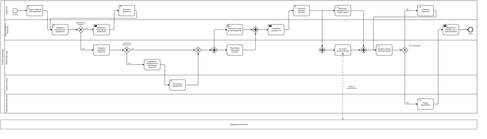

# Архитектор процессов: ИИ-помощник «текст → BPMN 2.0»

Аналитик описывает бизнес-процесс текстом или загружает документ. Ассистент строит BPMN-диаграмму:
пулы и дорожки участников, задачи, развилки с условиями и веткой «иначе», параллельные операции,
циклы доработки, сроки и эскалации. Файл проходит проверку по XSD BPMN 2.0 (OMG), содержит
BPMNDiagram/DI с координатами и открывается и редактируется в bpmn.io.

Схему можно править словами («добавь согласование юристом после шага 3», «сделай проверку
параллельной»). Можно проверить её линтером, сформировать регламент (DOCX), посчитать узкие места и
Monte Carlo, построить RACI и тест-сценарии.



## Запуск за 5 минут

Нужен Python 3.10+. Все команды выполняются из корня репозитория.

```bash
python -m pip install -r requirements.txt
cp .env.example .env            # Windows: copy .env.example .env — затем укажите модель (см. ниже)
python -m uvicorn server:app --host 127.0.0.1 --port 8080
# Windows одной командой: run.bat;  Linux/macOS: ./run.sh
# Docker: docker build -t bpmn-agent . && docker run -p 8000:8000 --env-file .env bpmn-agent
```

Откройте http://127.0.0.1:8080. Без ключа модели всё, кроме генерации из текста, тоже работает:
шаблоны, примеры, импорт `.bpmn`, линтер, регламент, аналитика, RACI, тест-пути и экспорт.
Проверить подключение к модели: `python scripts/check_llm.py`.

## Как сменить модель

Модель задаётся только конфигурацией в `.env`, код менять не нужно. Все обращения к LLM идут через один
адаптер `complete(messages, schema)` (`backend/app/llm/client.py`).

| Где модель | `.env` |
|---|---|
| **Yandex AI Studio** (финал) | `LLM_PROVIDER=yandex`, `YANDEX_FOLDER_ID=b1g…`, `LLM_MODEL=gpt-oss-120b/latest` (или `qwen3-235b-a22b-fp8/latest`, `yandexgpt/latest`), `LLM_API_KEY=` API-ключ или IAM-токен |
| **gpt-oss-120b / Qwen3** через vLLM, Ollama, LM Studio, OpenRouter | `LLM_PROVIDER=openai`, `LLM_BASE_URL=http://host:8000/v1`, `LLM_MODEL=openai/gpt-oss-120b` или `Qwen/Qwen3.6-35B-A3B` |
| Google Gemini / Anthropic Claude | `LLM_PROVIDER=gemini` или `anthropic` + `LLM_API_KEY` |

Дополнительные параметры:
- `LLM_JSON_MODE`: какой структурированный вывод запрашивать. Если endpoint не поддерживает
  json_schema, адаптер сам перейдёт на json_object, затем на JSON по промпту.
- `LLM_REASONING_EFFORT`: глубина рассуждений gpt-oss.
- `LLM_REPAIR_MODEL`: отдельная модель для самоисправления.
- `MAX_REPAIRS`: число раундов самоисправления.
- `PII_MASK`, `PII_MASK_ADDRESSES`, `PII_MASK_OBJECTS`: маскирование персональных данных.
- `LLM_ONPREM_ONLY`: разрешить только локальную модель.
- `PROMPT_VERSIONS`: закрепить версии промптов.

Полный список — в `.env.example`. Изменения `.env` подхватываются без перезапуска сервера.

## Как это работает

```
текст / документ (txt, docx, pdf, расшифровка интервью; длинные — по частям)
 → маскирование ПДн (ФИО, телефоны, e-mail, ИНН/СНИЛС, договоры)            [детерминированно]
 → LLM: извлечение IR (JSON) по JSON Schema, few-shot                         [LLM]
 → проверка IR: pydantic-схема, ссылки, линтер, уточняющие вопросы             [детерминированно]
 → сборщик BPMN: IR → граф (DIAGRAM API) → definitions/collaboration/laneSet/
   sequenceFlow/gateways/default flow/conditionExpression/boundary timers     [детерминированно]
 → автораскладка DI: пулы и дорожки, слева направо, ортогональные связи       [детерминированно]
 → XSD BPMN 2.0 + семантический валидатор + линтер                             [детерминированно]
 → самоисправление: сначала правила, затем LLM чинит IR (≤ MAX_REPAIRS),
   затем честный отчёт об остаточных проблемах                                [правила → LLM]
 → bpmn.io (просмотр и правка) · экспорт .bpmn / SVG / PNG / JSON IR / регламент
```

LLM нигде не пишет XML: модель только понимает текст (IR), правит IR по просьбе аналитика, оценивает
длительности, объясняет процесс и даёт рекомендации. Сборка, раскладка, проверки, линтер,
маскирование, симуляция, RACI и тест-пути работают детерминированно и покрыты тестами.

Режим «Через генерацию кода» сохранён из первого прототипа: там LLM пишет Python-код на
`DIAGRAM API` по IR. Основной режим этот код строит из IR детерминированно, поэтому для
просмотра он доступен в «Технических деталях».

### Приёмы работы с моделью

- **Структурированный вывод.** JSON Schema IR (`/api/ir-schema`) передаётся модели через
  `response_format: json_schema` (OpenAI-совместимые, Yandex), `responseJsonSchema` (Gemini) или в
  промпте. Ответ проверяется pydantic-схемой и проверкой ссылок.
- **Устойчивость к слабым моделям.** Типичные ошибки исправляются до валидации: `userTask` →
  `user_task`, участник указан именем вместо id, `source`/`target` вместо `from`/`to`, висящие
  запятые, обрезанный JSON, блоки `<think>`.
- **Few-shot.** В `ir_extract.system` два полных примера: многоучастниковый процесс с XOR, AND и
  циклом и процесс с внешней организацией.
- **Самоисправление.** Ошибки линтера, валидатора и XSD приходят с id элементов IR и подсказкой,
  что исправить. Модель возвращает исправленный IR целиком, при этом id сохраняются.
- **Работа с контекстом.** Длинный документ режется по абзацам и обрабатывается частями; IR частей
  объединяются без дублей. При правке словами модель получает компактный IR и нумерованный список
  шагов («после шага 3»).
- **Промпты в файлах с версиями.** `backend/app/prompts/<имя>.v<N>.md`. Используется последняя
  версия или закреплённая через `PROMPT_VERSIONS`; версии пишутся в журнал каждого запуска.
- **Без выдумывания.** Цитата-основание для каждого шага сверяется с исходным текстом. Допущения
  помечаются на схеме аннотациями, а в режиме «С уточнениями» вместо догадок задаются вопросы.

## Возможности

Краткий список ниже, подробный — в [docs/features.md](docs/features.md).

- Генерация в двух режимах: без уточнений (допущения видны аннотациями) и с уточнениями (вопросы:
  кто исполнитель, какое условие, что «иначе», чем заканчивается).
- **Правка диалогом.** Меняется IR, а не XML. После правки показывается diff «до/после», новое
  подсвечивается зелёным, изменённое — оранжевым; откат через «Историю». Ручные правки на холсте
  сохраняются.
- **Линтер** (20 проверок) с кнопкой «исправить автоматически».
- **Регламент и СОП** (Markdown, DOCX) и объяснение процесса простым языком.
- **Импорт документов** txt, docx, pdf и расшифровок интервью.
- **Защита ПДн.** Данные маскируются до отправки в модель и подставляются обратно; в UI видно, что
  было замаскировано. Есть режим «только on-prem».
- **Журнал действий ИИ.** По каждому запросу: модель, версии промптов, токены, время, ошибки,
  число исправлений; экспорт JSON. Секреты в журнал не пишутся.
- **Аналитика.** Критический путь, тепловая карта шагов, Monte Carlo (среднее, p90, загрузка
  участников, доли ветвей), сравнение «как есть / как будет», оценка длительностей моделью,
  рекомендации (помечены как рекомендации).
- **SLA и эскалации:** граничные таймеры BPMN.
- **RACI** (CSV, XLSX), **тест-пути** (CSV, Markdown), **5 отраслевых шаблонов энергетики**,
  экспорт JSON IR и BPMN с пометкой совместимости с Camunda 8.
- Сохранено из прототипа: связь фраз текста и шагов схемы, аудит покрытия требований, показ процесса
  с маскотом, проигрывание токенов, поиск шагов, карточки сроков и документов, история версий.

## Примеры

В [`examples/`](examples) пять процессов. Для каждого: описание `input.txt`, IR `plan.json`,
`result.bpmn`, `result.png`, `result.svg` и отчёт проверок `report.json`.

| Пример | Что показывает |
|---|---|
| [03_grid_connection](examples/03_grid_connection) — техприсоединение | 5 дорожек + подрядчик, XOR с веткой «иначе», 2 блока AND, подпроцесс, цикл замечаний |
| [01_credit](examples/01_credit) — выдача кредита | 6 дорожек + внешнее БКИ, цикл дозаполнения, параллельные проверки |
| [05_outage](examples/05_outage) — аварийное отключение | параллельное SMS-оповещение, цикл с резервным питанием |
| [04_hiring](examples/04_hiring) — подбор сотрудника | инклюзивный шлюз, цикл отбора |
| [02_eshop](examples/02_eshop) — интернет-магазин | пропуск шага по условию, параллельная сборка, возврат |

Как получены примеры: `plan.json` — эталонные IR, составленные вручную в формате ответа модели;
`result.bpmn` собран по ним детерминированно. Прогнать те же описания через модель:
`python scripts/build_examples.py --llm --render`, с метриками — `python eval/run_eval.py --render`.
Шаблоны энергетики лежат в `backend/app/templates/`, в UI — «Отраслевой шаблон».

## Проверка качества

```bash
cd backend && python -m pytest -q              # 110 тестов: адаптер, IR, сборщик, раскладка, линтер, ПДн,
                                               # интеграция «текст → валидный .bpmn» с замоканным LLM, API
python eval/run_eval.py --offline --render     # детерминированная часть на эталонных IR + импорт в bpmn-js
python eval/run_eval.py --modes ir --render    # отдельный прогон на реальной модели из .env
node tools/smoke-ui.mjs http://127.0.0.1:8094  # UI-смоук (сервер: python backend/tests/serve_ui_fixture.py)
```

## Структура

```
backend/app/
  llm/client.py        адаптер LLM: openai-совместимые (vLLM/Ollama/OpenRouter), yandex, gemini, anthropic
  llm/plan.py          IR (pydantic), нормализация ответов, ремонт JSON, детерминированный компилятор IR → DIAGRAM
  llm/prompts.py       загрузчик версионированных промптов   prompts/*.vN.md — тексты промптов
  pipeline.py          оркестрация: ПДн → IR → проверка → сборка → проверки → самоисправление → отчёт
  ir/lint.py           линтер процесса, автоисправления, уточняющие вопросы
  ir/analytics.py      длительности, критический путь, тепловая карта, Monte Carlo, тест-пути, RACI
  ir/engine.py         движок токенов (симуляция и перечисление путей)
  ir/sop.py            регламент/СОП (Markdown, DOCX), объяснение без модели
  ir/diff.py, merge.py, from_diagram.py   diff версий, слияние частей документа, BPMN → IR
  bpmn/                DIAGRAM API, валидатор, раскладка, сериализатор, XSD (schemas/ — XSD OMG), импорт, Camunda 8
  pii.py · docimport.py · runlog.py · tools_api.py · main.py
  templates/           отраслевые шаблоны (IR)
frontend/              bpmn-js Modeler, без шага сборки; toolkit.js — вкладка «Инструменты»
examples/ · eval/ · scripts/ · tools/ (рендер в bpmn-js, UI-смоук) · docs/
```

Документация: [возможности](docs/features.md) · [ограничения](docs/limitations.md) ·
[архитектура](docs/architecture.md) · [DIAGRAM API](docs/api.md).
